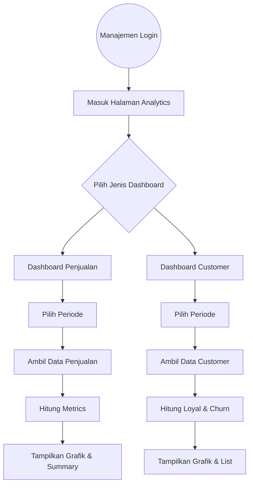

# 🧠 Analytics Dashboard Module — ThinkNalyze

**Branch:** `feat/PBI-Analytics-Dashboard`  
**Assignee:** Farhan Adelio Prayata (2306240162)

---

## 📖 Ringkasan Modul

Branch ini berfokus pada pengembangan modul analitik bisnis pada aplikasi ThinkNalyze yang digunakan oleh pihak manajemen untuk memonitor performa platform.

Modul ini berfungsi sebagai **pusat pengambilan keputusan (Decision Support Dashboard)** dengan menyajikan data penjualan paket serta perilaku pelanggan secara visual, terstruktur, dan berbasis periode waktu.

### Melalui modul ini, manajemen dapat:

- Mengetahui paket paling laku dan kontribusi revenue
- Menganalisis tren pertumbuhan penjualan
- Mengidentifikasi pelanggan loyal
- Mengukur churn rate dan retensi pengguna

---

## 🚀 Cakupan Fitur (Scope of Work)

Berikut rincian fitur dalam branch ini:

### 1. 📊 Sales Package Performance Dashboard

Dashboard untuk memantau performa setiap paket langganan.

**Menampilkan:**
- Most Sold Package
- Highest Revenue Package
- Highest Growth Package
- Bar Chart distribusi penjualan
- Line Chart tren penjualan
- Tabel detail performa package

**Perhitungan Sistem:**
- Total Sales
- Total Revenue
- Percentage Contribution
- Growth Rate dibanding periode sebelumnya

---

### 2. 👥 Customer Loyalty & Churn Dashboard

Dashboard untuk menganalisis perilaku dan retensi pelanggan.

**Menampilkan:**
- Total Active Users
- Total Churn Users
- Churn Rate
- Daftar Customer Loyal
- Daftar Customer Churn
- Grafik pertumbuhan user baru
- Grafik churn rate per bulan

**Perhitungan Sistem:**
- Identifikasi Loyal Customer
- Identifikasi Churn Customer
- Growth pengguna baru
- Retention metrics

---

### 3. 🗓️ Period Filter — Sales Dashboard

Filter periode khusus dashboard penjualan.

**Mendukung:**
- Bulanan
- Tahunan
- Custom Date Range

**Perilaku:**
- Auto refresh data tanpa reload halaman
- Validasi rentang tanggal
- Default periode bulan berjalan

---

### 4. 🗓️ Period Filter — Customer Dashboard

Filter periode khusus dashboard pelanggan.

**Mendukung:**
- Bulanan
- Tahunan
- Custom range

**Perilaku:**
- Perhitungan ulang churn & loyalitas
- Auto update chart
- Fallback jika tidak ada churn

---

## 🔄 Alur Logika Utama (User Flow)

Berikut alur bagaimana manajemen menggunakan dashboard analitik:

---

## 🎯 Tujuan Bisnis

Modul ini dirancang untuk membantu manajemen melakukan:

- ✅ Evaluasi performa produk
- ✅ Evaluasi strategi pricing
- ✅ Analisis retensi pelanggan
- ✅ Perencanaan promosi
- ✅ Pengambilan keputusan berbasis data (data-driven decision making)
