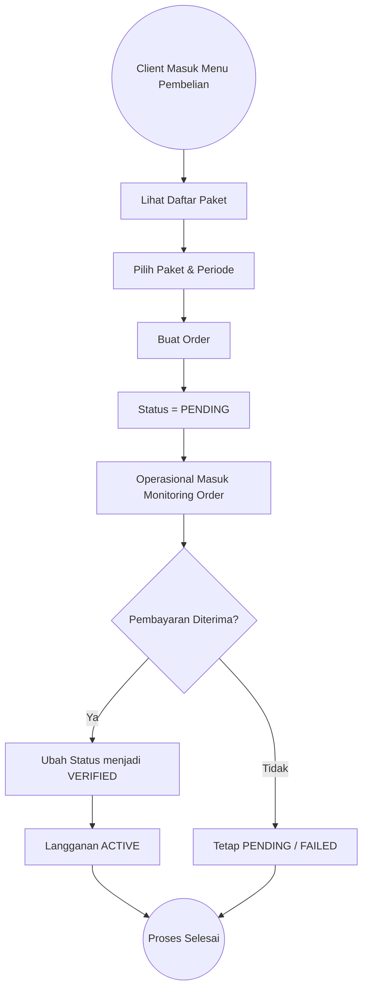

# 💳 Subscription & Order Module — ThinkNalyze

**Branch:** `feat/PBI-Subscription-Order`
**Assignee:** Fariz Muhammad Rayhansyah Ramadhan - 2306203854

---

## 📖 Ringkasan Modul

Branch ini berfokus pada pengembangan modul **Subscription & Order Management** pada aplikasi ThinkNalyze.

Modul ini menangani seluruh alur bisnis terkait monetisasi platform, mulai dari pengelolaan paket oleh Operasional hingga proses pembelian dan verifikasi transaksi.

Melalui modul ini:

* Operasional dapat mengelola konfigurasi paket langganan
* Client dapat melakukan pembelian paket
* Operasional dapat memverifikasi pembayaran
* Sistem mengaktifkan langganan hanya jika pembayaran valid

Modul ini memastikan bahwa proses aktivasi langganan berjalan secara terkontrol dan sesuai validasi bisnis.

---

## 🚀 Cakupan Fitur (Scope of Work)

Berikut rincian fitur dalam branch ini:

---

### 1. 📦 Manajemen Paket (Operasional)

Fitur untuk mengelola konfigurasi paket berlangganan yang tersedia di sistem.

**Mencakup:**

* Tambah paket baru
* Edit konfigurasi paket
* Hapus paket
* Pengaturan harga dan durasi
* Pengaturan kuota/limit layanan
* Status aktif / nonaktif paket

**Perilaku Sistem:**

* Validasi harga dan konfigurasi
* Hanya paket aktif yang dapat dibeli oleh client
* Perubahan konfigurasi langsung tercermin pada katalog paket

---

### 2. 🛒 Pembelian Paket (Client)

Fitur untuk memungkinkan client memilih dan membeli paket langganan.

**Mencakup:**

* Menampilkan daftar paket aktif
* Pemilihan periode langganan
* Perhitungan total harga
* Pembuatan order

**Status Awal Transaksi:**

* `PENDING`

**Perilaku Sistem:**

* Sistem menghasilkan order dengan nomor unik
* Langganan belum aktif sebelum pembayaran diverifikasi
* Detail pembelian dapat dilihat setelah order dibuat

---

### 3. 🧾 Monitoring & Verifikasi Order (Operasional)

Fitur untuk memantau dan memverifikasi transaksi pembelian client.

**Mencakup:**

* Daftar transaksi pembelian
* Filter berdasarkan status transaksi
* Detail transaksi
* Aksi verifikasi pembayaran

**Status Transaksi:**

* `PENDING`
* `VERIFIED`
* `FAILED`

**Perilaku Sistem:**

* Jika status diubah menjadi `VERIFIED` → langganan menjadi `ACTIVE`
* Jika tidak diverifikasi → langganan tetap tidak aktif
* Perubahan status langsung tercermin pada sistem

---

## 🔄 Alur Logika Utama (User Flow)

Berikut alur utama proses Subscription & Order:

---

## 🎯 Tujuan Bisnis

Modul ini dirancang untuk:

* ✅ Mendukung monetisasi platform melalui sistem langganan
* ✅ Memberikan fleksibilitas pengaturan paket oleh operasional
* ✅ Memastikan aktivasi layanan hanya terjadi setelah pembayaran valid
* ✅ Menjaga integritas dan kontrol transaksi dalam sistem