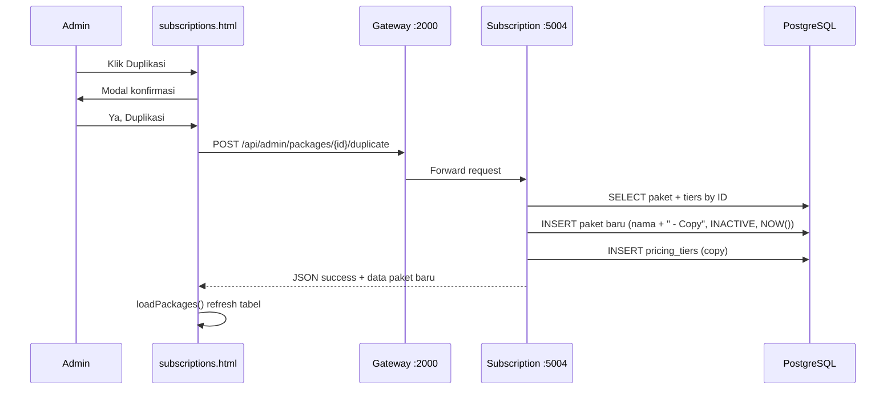

# ThinkNalyze Live Coding Prep - Modul Paket

> **SAAT LIVE CODING (30 menit): buka [`LIVE_CODING_CHEATSHEET.md`](LIVE_CODING_CHEATSHEET.md) — bukan file ini.**
> **v2 cheat sheet** = pola soal kelompok lain: **modifikasi kecil bertarget** (filter, kolom, badge, validasi) — bukan fix bug / buat dari nol.
> File ini = referensi & prediksi lengkap. Cheat sheet = Ctrl+F anchor + kode copy-paste per §1–§45.

Dokumen ini disusun sebagai catatan persiapan pribadi untuk simulasi live coding. Fokusnya ada pada modul Paket dan alur terkait di service Subscription, Gateway, dan halaman frontend client/management.

## 1. Tujuan Dokumen

Dokumen ini dipakai untuk:

1. Mengingat file mana yang harus dibuka ketika diminta mengubah fitur Paket.
2. Memahami alur data dari frontend ke backend sampai database.
3. Menyusun langkah jawaban yang cepat untuk soal CRUD dan Read.
4. Memastikan perubahan dilakukan di lokasi yang benar tanpa merusak flow lain.
5. **Part 2 (di akhir dokumen):** Implementation Guide live coding detail — format Soal/Analisis/File/Before/After/Testing per cluster A–L.
6. **Part 3 (di akhir dokumen):** Prediksi soal live coding batch 1 — TOP 20 C/U/D + TOP 20 R + 5 paling mungkin, berdasarkan reverse engineering kode aktual.
7. **Part 4 (di akhir dokumen):** Soal batch 2–3 — 40 prediksi (Tabel A/B) + §16–§45 + peta coverage semua halaman client.
8. **[`LIVE_CODING_CHEATSHEET.md`](LIVE_CODING_CHEATSHEET.md):** Cheat sheet operasional — §1–§45 (C/U/D + R) + §R-INV/PROOF/VERIFY dengan anchor Ctrl+F & kode siap paste.
9. **[`docs/HANDOFF_CONTEXT_LIVE_CODING.md`](docs/HANDOFF_CONTEXT_LIVE_CODING.md):** Konteks handoff untuk agent AI baru.

## 2. Peta Cepat Modul Paket

### Backend utama

- Controller paket: [subscription/app/modules/packages/controller.go](subscription/app/modules/packages/controller.go)
- Service paket: [subscription/app/modules/packages/service.go](subscription/app/modules/packages/service.go)
- Repository paket: [subscription/app/modules/packages/repository.go](subscription/app/modules/packages/repository.go)
- Types paket: [subscription/app/modules/packages/types.go](subscription/app/modules/packages/types.go)
- Route subscription: [subscription/app/routes/router.go](subscription/app/routes/router.go)

### Frontend client

- Katalog paket user: [frontend/client/packages-catalog.html](frontend/client/packages-catalog.html)
- Checkout paket: [frontend/client/checkout.html](frontend/client/checkout.html)
- Billing history: [frontend/client/billing-history.html](frontend/client/billing-history.html)
- Detail order: [frontend/client/order-detail.html](frontend/client/order-detail.html)
- Subscription user: [frontend/client/subscription-me.html](frontend/client/subscription-me.html)

### Frontend operasional (CRUD paket)

- List paket: [frontend/ops/subscriptions.html](frontend/ops/subscriptions.html)
- Create paket: [frontend/ops/subscriptions-create.html](frontend/ops/subscriptions-create.html)
- Edit paket: [frontend/ops/subscriptions-edit.html](frontend/ops/subscriptions-edit.html)

### Frontend management (analytics/read)

- Dashboard penjualan paket: [frontend/management/dashboard-packages.html](frontend/management/dashboard-packages.html)
- Detail paket analytics: [frontend/management/package-detail.html](frontend/management/package-detail.html)

## 3. Alur Besar Yang Harus Diingat

### Alur Create Package

1. Request masuk ke controller package.
2. Controller decode body JSON.
3. Controller kirim payload ke worker lewat dispatcher.
4. Service melakukan validasi bisnis.
5. Repository insert ke tabel `subscription.packages`.
6. Pricing tier disimpan ke `subscription.package_pricing`.
7. Response JSON dikirim ke frontend.

### Alur Read Package

1. Frontend memanggil endpoint katalog atau detail.
2. Gateway meneruskan request ke subscription service.
3. Controller memilih handler list atau detail.
4. Service memanggil repository untuk ambil data.
5. Repository query ke database.
6. Response dirender menjadi kartu, tabel, atau detail panel.

### Alur Update Package

1. Admin buka halaman management.
2. Request update dikirim ke endpoint paket.
3. Controller ambil `id` dari URL.
4. Service validasi nama, harga, kuota, dan tiers.
5. Repository update paket dan replace pricing tiers.

### Alur Delete Package

1. Admin memilih paket non aktif.
2. Service cek paket masih ada atau tidak.
3. Service cek status tidak boleh `ACTIVE`.
4. Service cek jumlah subscriber aktif.
5. Repository soft delete dengan status `DELETED`.

### Alur Pembayaran Paket

1. User pilih paket dari katalog.
2. User masuk ke checkout.
3. Checkout memanggil `POST /api/orders`.
4. Service orders cek KYC, paket aktif, dan pricing tier.
5. Order dibuat dengan status `PENDING_PAYMENT`.
6. User upload bukti transfer di detail order.
7. Operasional verifikasi pembayaran.
8. Status order menjadi `PAID`.
9. Subscription aktif diperbarui dari order.

## 4. Patokan File dan Fungsi Penting

### Package controller

- [subscription/app/modules/packages/controller.go](subscription/app/modules/packages/controller.go#L36)
  - `CreatePackageHandler`
- [subscription/app/modules/packages/controller.go](subscription/app/modules/packages/controller.go#L79)
  - `GetPackagesAdminHandler`
- [subscription/app/modules/packages/controller.go](subscription/app/modules/packages/controller.go#L108)
  - `GetCatalogHandler`
- [subscription/app/modules/packages/controller.go](subscription/app/modules/packages/controller.go#L126)
  - `UpdatePackageHandler`
- [subscription/app/modules/packages/controller.go](subscription/app/modules/packages/controller.go#L208)
  - `DeletePackageHandler`
- [subscription/app/modules/packages/controller.go](subscription/app/modules/packages/controller.go#L269)
  - `TogglePackageStatusHandler`

### Package service

- [subscription/app/modules/packages/service.go](subscription/app/modules/packages/service.go#L43)
  - `CreatePackage`
- [subscription/app/modules/packages/service.go](subscription/app/modules/packages/service.go#L77)
  - `GetAdminPackages`
- [subscription/app/modules/packages/service.go](subscription/app/modules/packages/service.go#L82)
  - `GetCatalogPackages`
- [subscription/app/modules/packages/service.go](subscription/app/modules/packages/service.go#L87)
  - `UpdatePackage`
- [subscription/app/modules/packages/service.go](subscription/app/modules/packages/service.go#L129)
  - `TogglePackageStatus`
- [subscription/app/modules/packages/service.go](subscription/app/modules/packages/service.go#L147)
  - `DeletePackage`

### Package repository

- [subscription/app/modules/packages/repository.go](subscription/app/modules/packages/repository.go#L103)
  - `CreatePackage`
- [subscription/app/modules/packages/repository.go](subscription/app/modules/packages/repository.go#L133)
  - `GetPackages`
- [subscription/app/modules/packages/repository.go](subscription/app/modules/packages/repository.go#L188)
  - `GetPackageByID`
- [subscription/app/modules/packages/repository.go](subscription/app/modules/packages/repository.go#L205)
  - `GetPackageByName`
- [subscription/app/modules/packages/repository.go](subscription/app/modules/packages/repository.go#L222)
  - `UpdatePackage`
- [subscription/app/modules/packages/repository.go](subscription/app/modules/packages/repository.go#L250)
  - `TogglePackageStatus`
- [subscription/app/modules/packages/repository.go](subscription/app/modules/packages/repository.go#L269)
  - `CountActiveSubscribers`
- [subscription/app/modules/packages/repository.go](subscription/app/modules/packages/repository.go#L281)
  - `DeletePackage`
- [subscription/app/modules/packages/repository.go](subscription/app/modules/packages/repository.go#L295)
  - `GetPricingTier`

### Route daftar paket dan order

- [subscription/app/routes/router.go](subscription/app/routes/router.go#L20)
  - route admin package
- [subscription/app/routes/router.go](subscription/app/routes/router.go#L37)
  - route katalog paket client
- [subscription/app/routes/router.go](subscription/app/routes/router.go#L49)
  - route order client
- [subscription/app/routes/router.go](subscription/app/routes/router.go#L62)
  - route verifikasi operasional

## 5. Pola Jawaban Cepat Saat Live Coding

### Kalau diminta menambah endpoint baru

1. Cari dulu controller yang paling dekat dengan fitur.
2. Cek apakah service sudah punya fungsi yang dibutuhkan.
3. Kalau belum ada, tambahkan function di service.
4. Kalau butuh query database, tambahkan di repository.
5. Daftarkan route di router.
6. Kalau ada tampilan, tambahkan fetch di frontend.
7. Tes alur dari browser atau `curl`.

### Kalau diminta mengubah validasi

1. Mulai dari service, bukan frontend.
2. Tambahkan atau ubah pengecekan input di service.
3. Jika validasi butuh data DB, ubah repository.
4. Update pesan error agar jelas.
5. Cek apakah frontend perlu menampilkan pesan itu.

### Kalau diminta read/list/detail

1. Cari fungsi list atau detail di controller.
2. Ikuti ke service.
3. Cek query repository.
4. Lihat struktur JSON response.
5. Sesuaikan komponen HTML yang memanggil endpoint.

### Kalau diminta update/delete

1. Cek apakah action hanya boleh untuk status tertentu.
2. Pastikan service memeriksa kondisi bisnis.
3. Repository harus mengubah data dengan aman.
4. Kalau soft delete, jangan hapus data fisik.
5. Cek apakah list frontend perlu refresh setelah aksi berhasil.

## 6. Snippet Kerja yang Sering Dipakai

### Pola handler controller

```go
func (c *Controller) ExampleHandler(w http.ResponseWriter, r *http.Request) {
    // 1. Ambil input dari body, query, atau path
    // 2. Validasi minimal
    // 3. Dispatch ke service/worker
    // 4. Handle error per status code
    // 5. Kembalikan JSON response
}
```

### Pola service

```go
func (s *packageService) ExampleAction(ctx context.Context, input ExampleDTO) (*Package, error) {
    // 1. Validasi payload
    // 2. Cek data existing
    // 3. Cek rule bisnis
    // 4. Panggil repository
    // 5. Return hasil atau error yang jelas
}
```

### Pola repository

```go
func (r *packageRepo) ExampleQuery(ctx context.Context, id string) (*Package, error) {
    // 1. Tulis query SQL
    // 2. QueryRow atau Query
    // 3. Scan hasil ke struct
    // 4. Handle pgx.ErrNoRows
    // 5. Return data atau error yang dibungkus
}
```

### Pola frontend fetch

```javascript
async function loadSomething() {
    var res = await fetch('/api/example', { credentials: 'include' });
    var json = await res.json();
    if (!res.ok || !json.success) {
        showToast(json.error_message || 'Gagal memuat data.', 'danger');
        return;
    }
    renderSomething(json.data || json);
}
```

## 7. 20 Kemungkinan Soal C / U / D

Bagian ini dipakai untuk latihan skenario create, update, dan delete.

### 1. Buat paket baru dari halaman operasional

- Inti soal: admin menambahkan paket baru beserta pricing tiers.
- File utama: [frontend/ops/subscriptions-create.html](frontend/ops/subscriptions-create.html)
- Backend: `CreatePackageHandler`, `CreatePackage`, `CreatePackage`
- Langkah:
  1. Cari tombol form create di halaman management.
  2. Pastikan request dikirim ke `POST /api/admin/packages`.
  3. Periksa body JSON berisi `name`, `price`, `quota`, `status`, `pricing_tiers`.
  4. Di service, validasi nama, harga, kuota, dan tier.
  5. Di repository, insert paket lalu simpan pricing tiers.
  6. Refresh daftar paket setelah sukses.

### 2. Buat paket baru dengan validasi nama unik

- Inti soal: hindari nama paket ganda.
- File utama: [subscription/app/modules/packages/service.go](subscription/app/modules/packages/service.go#L43)
- Langkah:
  1. Tambahkan cek `GetPackageByName` sebelum insert.
  2. Jika paket sudah ada, return error nama sudah digunakan.
  3. Pastikan controller menerjemahkan error ke response yang tepat.

### 3. Buat paket baru dengan minimal satu pricing tier

- Inti soal: paket tidak boleh tanpa durasi harga.
- File utama: [subscription/app/modules/packages/service.go](subscription/app/modules/packages/service.go#L43)
- Langkah:
  1. Cek `len(payload.PricingTiers) == 0`.
  2. Return error jika kosong.
  3. UI perlu menambahkan minimal satu tier sebelum submit.

### 4. Buat paket baru dengan validasi harga tier

- Inti soal: durasi harus > 0 dan harga tidak negatif.
- File utama: [subscription/app/modules/packages/service.go](subscription/app/modules/packages/service.go#L43)
- Langkah:
  1. Loop semua tier.
  2. Validasi `DurationMonths > 0`.
  3. Validasi `Price >= 0`.
  4. Tampilkan pesan error yang sesuai.

### 5. Ubah paket aktif menjadi paket baru versi revisi

- Inti soal: admin update paket lama.
- File utama: [subscription/app/modules/packages/controller.go](subscription/app/modules/packages/controller.go#L126)
- Langkah:
  1. Ambil `id` dari URL.
  2. Decode payload update.
  3. Service validasi nama, harga, kuota, tiers.
  4. Pastikan data lama ada.
  5. Repository update paket dan replace tiers.

### 6. Ubah nama paket yang sudah dipakai paket lain

- Inti soal: cegah duplikasi nama pada update.
- File utama: [subscription/app/modules/packages/service.go](subscription/app/modules/packages/service.go#L87)
- Langkah:
  1. Cari paket dengan `GetPackageByName`.
  2. Jika ID berbeda, return error.
  3. Controller kirim response conflict.

### 7. Ubah harga dasar paket

- Inti soal: harga dasar paket berubah.
- File utama: [subscription/app/modules/packages/repository.go](subscription/app/modules/packages/repository.go#L222)
- Langkah:
  1. Ubah payload di form edit.
  2. Pastikan service memvalidasi harga > 0.
  3. Repository update kolom `price`.
  4. Reload halaman list agar harga baru terlihat.

### 8. Ubah kuota paket

- Inti soal: admin mengganti kuota request.
- File utama: [subscription/app/modules/packages/service.go](subscription/app/modules/packages/service.go#L87)
- Langkah:
  1. Input kuota baru di form edit.
  2. Validasi kuota > 0.
  3. Repository update kolom `quota`.

### 9. Ubah pricing tiers paket

- Inti soal: ganti harga 1 bulan, 3 bulan, 12 bulan.
- File utama: [subscription/app/modules/packages/repository.go](subscription/app/modules/packages/repository.go#L80)
- Langkah:
  1. Hapus tier lama.
  2. Insert tier baru satu per satu.
  3. Pastikan relasi package_id tetap sama.

### 10. Ubah status paket aktif menjadi nonaktif

- Inti soal: toggle status ACTIVE ke INACTIVE.
- File utama: [subscription/app/modules/packages/controller.go](subscription/app/modules/packages/controller.go#L269)
- Langkah:
  1. Ambil id paket dari URL.
  2. Service cek paket ada.
  3. Toggle status ke `INACTIVE`.
  4. Response sukses dikirim ke frontend.

### 11. Ubah status paket nonaktif menjadi aktif kembali

- Inti soal: admin mengaktifkan paket lama.
- File utama: [subscription/app/modules/packages/service.go](subscription/app/modules/packages/service.go#L129)
- Langkah:
  1. Ambil data existing.
  2. Jika status `INACTIVE`, ubah menjadi `ACTIVE`.
  3. Simpan ke repository.

### 12. Hapus paket nonaktif

- Inti soal: soft delete hanya untuk paket nonaktif.
- File utama: [subscription/app/modules/packages/service.go](subscription/app/modules/packages/service.go#L147)
- Langkah:
  1. Service cek status paket bukan ACTIVE.
  2. Cek masih ada subscriber aktif atau tidak.
  3. Jika ada subscriber aktif, tolak delete.
  4. Repository update status menjadi `DELETED`.

### 13. Hapus paket yang masih aktif

- Inti soal: delete aktif harus ditolak.
- File utama: [subscription/app/modules/packages/service.go](subscription/app/modules/packages/service.go#L147)
- Langkah:
  1. Ambil data paket by ID.
  2. Kalau status ACTIVE, return error.
  3. Tampilkan pesan bahwa paket aktif tidak bisa dihapus.

### 14. Hapus paket yang masih punya pelanggan aktif

- Inti soal: ada PAID atau PENDING_PAYMENT yang memakai paket itu.
- File utama: [subscription/app/modules/packages/repository.go](subscription/app/modules/packages/repository.go#L269)
- Langkah:
  1. Panggil `CountActiveSubscribers`.
  2. Jika lebih dari 0, return conflict.
  3. Jangan lanjut soft delete.

### 15. Buat paket dari endpoint admin dengan response JSON sukses

- Inti soal: fokus pada format response backend.
- File utama: [subscription/app/modules/packages/controller.go](subscription/app/modules/packages/controller.go#L36)
- Langkah:
  1. Pastikan response berisi `success`, `message`, `data`.
  2. Jika validasi gagal, return error message yang konsisten.

### 16. Tambah filter status pada list admin paket

- Inti soal: list paket harus bisa difilter ACTIVE/INACTIVE/DELETED.
- File utama: [subscription/app/modules/packages/controller.go](subscription/app/modules/packages/controller.go#L79)
- Langkah:
  1. Ambil query param `status`.
  2. Kirim ke service.
  3. Repository tambah klausa WHERE sesuai status.

### 17. Tambah filter harga minimum dan maksimum pada list admin paket

- Inti soal: admin mencari paket berdasarkan range harga.
- File utama: [subscription/app/modules/packages/controller.go](subscription/app/modules/packages/controller.go#L79)
- Langkah:
  1. Ambil `min_price` dan `max_price`.
  2. Kirim sebagai payload filter.
  3. Repository bentuk query dinamis.

### 18. Ubah halaman management agar setelah create/update langsung reload list

- Inti soal: UI harus refresh setelah aksi sukses.
- File utama: [frontend/management/dashboard-packages.html](frontend/management/dashboard-packages.html)
- Langkah:
  1. Cari handler submit form.
  2. Setelah response sukses, panggil fungsi load ulang data.
  3. Reset form dan tutup modal.

### 19. Ubah tombol delete agar hanya muncul untuk paket nonaktif

- Inti soal: UI harus mengikuti rule backend.
- File utama: [frontend/management/dashboard-packages.html](frontend/management/dashboard-packages.html)
- Langkah:
  1. Saat render list, cek status paket.
  2. Jika ACTIVE, jangan tampilkan tombol delete.
  3. Jika INACTIVE, tampilkan tombol delete.

### 20. Ubah toggle status pada UI paket management

- Inti soal: tombol status switch berubah label sesuai kondisi.
- File utama: [frontend/management/dashboard-packages.html](frontend/management/dashboard-packages.html)
- Langkah:
  1. Render tombol ACTIVE/INACTIVE.
  2. Kirim request PATCH ke endpoint toggle.
  3. Setelah sukses, reload card.

## 8. 20 Kemungkinan Soal R

Bagian ini dipakai untuk latihan skenario read/list/detail.

### 1. Tampilkan katalog paket aktif di halaman client

- Inti soal: user melihat paket yang tersedia.
- File utama: [frontend/client/packages-catalog.html](frontend/client/packages-catalog.html)
- Langkah:
  1. Frontend fetch `/api/subscription/catalog`.
  2. Backend pakai `GetCatalogHandler`.
  3. Service memanggil `GetCatalogPackages`.
  4. Repository ambil paket status ACTIVE.
  5. Render kartu paket.

### 2. Tampilkan detail paket saat user klik pilih paket

- Inti soal: user menuju checkout dari katalog.
- File utama: [frontend/client/packages-catalog.html](frontend/client/packages-catalog.html#L271)
- Langkah:
  1. Fungsi `pilihPaket(packageId)` pindah ke checkout.
  2. Query string `package_id` dibaca di checkout.
  3. Checkout memuat detail paket via katalog.

### 3. Tampilkan halaman checkout paket

- Inti soal: user melihat ringkasan pembayaran.
- File utama: [frontend/client/checkout.html](frontend/client/checkout.html)
- Langkah:
  1. Ambil `package_id` dari URL.
  2. Panggil `loadPackage(packageId)`.
  3. Render nama paket, harga, kuota, dan durasi.

### 4. Tampilkan daftar order client di billing history

- Inti soal: user melihat riwayat order.
- File utama: [frontend/client/billing-history.html](frontend/client/billing-history.html)
- Langkah:
  1. Fetch `/api/orders` dengan credentials.
  2. Backend `ListOrdersClientHandler` kirim data.
  3. Render tabel dan mobile list.

### 5. Tampilkan detail order client

- Inti soal: user buka satu order spesifik.
- File utama: [frontend/client/order-detail.html](frontend/client/order-detail.html)
- Langkah:
  1. Ambil `id` dari query string.
  2. Fetch `/api/orders/{id}`.
  3. Tampilkan invoice number, package, total, status.

### 6. Tampilkan bukti transfer order

- Inti soal: user ingin lihat proof upload.
- File utama: [frontend/client/order-detail.html](frontend/client/order-detail.html#L831)
- Langkah:
  1. Fetch `/api/orders/{id}/payment-proof`.
  2. Jika ada file, tampilkan preview.
  3. Jika belum ada, tampilkan pesan kosong.

### 7. Tampilkan invoice order client

- Inti soal: user download invoice PDF.
- File utama: [frontend/client/billing-history.html](frontend/client/billing-history.html#L598)
- Langkah:
  1. Klik tombol download invoice.
  2. Fetch `/api/orders/{id}/invoice`.
  3. Response berupa blob PDF.
  4. Buat link download sementara.

### 8. Tampilkan status subscription aktif user

- Inti soal: user melihat paket aktif saat ini.
- File utama: [frontend/client/subscription-me.html](frontend/client/subscription-me.html)
- Langkah:
  1. Fetch `/api/subscriptions/me`.
  2. Render active subscription list.
  3. Tampilkan sisa hari aktif.

### 9. Tampilkan latest subscription user

- Inti soal: user melihat subscription terbaru.
- File utama: [subscription/app/routes/router.go](subscription/app/routes/router.go#L62)
- Langkah:
  1. Panggil `/api/subscriptions/latest`.
  2. Controller arahkan ke handler latest subscription.
  3. Repository ambil data terbaru user.

### 10. Tampilkan katalog paket di dashboard client

- Inti soal: user melihat kartu membership di dashboard.
- File utama: [frontend/client/dashboard.html](frontend/client/dashboard.html)
- Langkah:
  1. Fetch katalog aktif.
  2. Render list paket dan tombol renew/pilih.

### 11. Tampilkan daftar paket aktif di dashboard operasional

- Inti soal: halaman operasional membutuhkan data paket.
- File utama: [frontend/management/dashboard-packages.html](frontend/management/dashboard-packages.html)
- Langkah:
  1. Fetch data paket admin.
  2. Render metric, tabel, dan kartu.

### 12. Tampilkan detail paket operasional

- Inti soal: klik satu paket lalu masuk halaman detail.
- File utama: [frontend/management/package-detail.html](frontend/management/package-detail.html)
- Langkah:
  1. Ambil id paket dari URL.
  2. Fetch detail paket dan trend.
  3. Render metric dan chart.

### 13. Tampilkan data paket dengan filter status

- Inti soal: list admin difilter berdasarkan ACTIVE/INACTIVE.
- File utama: [subscription/app/modules/packages/controller.go](subscription/app/modules/packages/controller.go#L79)
- Langkah:
  1. Ambil query param status.
  2. Service dan repository ikut memfilter.
  3. Frontend kirim parameter filter.

### 14. Tampilkan data paket dengan filter harga

- Inti soal: admin cari paket berdasarkan range harga.
- File utama: [subscription/app/modules/packages/repository.go](subscription/app/modules/packages/repository.go#L133)
- Langkah:
  1. Kirim `min_price` dan `max_price`.
  2. Repository tambahkan WHERE `price >=` dan `price <=`.

### 15. Tampilkan detail order dari halaman admin/operasional

- Inti soal: operasional memeriksa pesanan tertentu.
- File utama: [subscription/app/routes/router.go](subscription/app/routes/router.go#L56)
- Langkah:
  1. Fetch `/api/admin/orders/{id}`.
  2. Service ambil detail order lengkap.
  3. Tampilkan proof URL jika ada.

### 16. Tampilkan list order admin

- Inti soal: operasional melihat semua order.
- File utama: [subscription/app/routes/router.go](subscription/app/routes/router.go#L56)
- Langkah:
  1. Fetch `/api/admin/orders`.
  2. Tambahkan filter dan pagination jika diperlukan.

### 17. Tampilkan list order client yang terfilter status

- Inti soal: riwayat order berdasarkan status.
- File utama: [frontend/client/billing-history.html](frontend/client/billing-history.html#L567)
- Langkah:
  1. Ubah query param `status`.
  2. Backend filter di repository.
  3. Render ulang tabel.

### 18. Tampilkan invoice download untuk admin

- Inti soal: admin/operasional download invoice dari order.
- File utama: [subscription/app/routes/router.go](subscription/app/routes/router.go#L56)
- Langkah:
  1. Panggil endpoint invoice admin.
  2. Pastikan status PAID.
  3. Return PDF blob.

### 19. Tampilkan detail subscription dari order yang sudah aktif

- Inti soal: user melihat subscription yang aktif setelah pembayaran disetujui.
- File utama: [subscription/app/routes/router.go](subscription/app/routes/router.go#L62)
- Langkah:
  1. Verify order jadi PAID.
  2. Activation membuat subscription record.
  3. Read endpoint mengambil subscription aktif.

### 20. Tampilkan ringkasan paket dari dashboard management

- Inti soal: halaman management butuh ringkasan paket paling laku.
- File utama: [frontend/management/dashboard-packages.html](frontend/management/dashboard-packages.html)
- Langkah:
  1. Fetch data aggregate.
  2. Render metric paling laku, revenue, growth.
  3. Pastikan state empty dan error ditangani.

## 9. Checklist Khusus Yang Paling Mungkin Keluar

### Kalau soal C/U/D

1. Tambah create package baru.
2. Update nama, harga, kuota, atau pricing tier.
3. Toggle status aktif/nonaktif.
4. Soft delete paket nonaktif.
5. Tolak delete jika masih ada subscriber aktif.

### Kalau soal R

1. Tampilkan daftar katalog paket.
2. Tampilkan detail paket di client atau management.
3. Tampilkan riwayat order.
4. Tampilkan detail order dan bukti transfer.
5. Tampilkan subscription aktif.

## 10. Urutan Pengerjaan Saat Di Depan Penguji

1. Baca pertanyaan dengan teliti.
2. Tentukan apakah yang diminta backend, frontend, atau keduanya.
3. Cari endpoint yang relevan.
4. Cari service method yang dipakai.
5. Cari repository query kalau ada perubahan data.
6. Kalau ada UI, cari file HTML yang memanggil endpoint.
7. Ubah minimal di tempat yang benar.
8. Test endpoint atau reload browser.
9. Jelaskan singkat alur perubahan saat diminta.

## 11. Catatan Praktis

1. Untuk create/update/delete, mulai dari service lalu repository.
2. Untuk read/list/detail, mulai dari frontend lalu controller lalu repository.
3. Kalau error business rule, jangan langsung ubah frontend; cek service dulu.
4. Kalau data tampil dobel atau tidak sinkron, cek apakah frontend melakukan fetch lebih dari sekali.
5. Kalau status tidak berubah, cek query update dan refresh state UI.

## 12. Ruang Tambahan Catatan Pribadi

- Soal yang paling sering keluar:
- File yang masih sering saya lupa:
- Error yang pernah muncul:
- Potongan query SQL yang perlu dihafal:
- Catatan untuk menjelaskan ke asdos:

## 13. Jawaban Implementasi Lengkap untuk Fitur Paket

Bagian ini adalah versi yang lebih konkret untuk latihan. Formatnya dibuat seperti jawaban yang bisa Anda pakai saat simulasi: file yang dibuka, bagian yang diubah, isi perubahan, dan cara cek hasilnya.

### 13.1 Create Package

#### File yang dibuka

- [subscription/app/modules/packages/controller.go](subscription/app/modules/packages/controller.go#L36)
- [subscription/app/modules/packages/service.go](subscription/app/modules/packages/service.go#L43)
- [subscription/app/modules/packages/repository.go](subscription/app/modules/packages/repository.go#L103)
- [subscription/app/modules/packages/types.go](subscription/app/modules/packages/types.go)
- [subscription/app/routes/router.go](subscription/app/routes/router.go#L20)
- [frontend/management/dashboard-packages.html](frontend/management/dashboard-packages.html)

#### Alur implementasi

1. Frontend management mengirim body JSON create package.
2. Controller decode body ke `CreatePackageDTO`.
3. Controller dispatch ke job `create_package`.
4. Service validasi name, price, quota, dan pricing tiers.
5. Repository insert ke `subscription.packages`.
6. Repository simpan pricing tiers ke `subscription.package_pricing`.
7. Frontend reload list setelah response sukses.

#### Bentuk payload yang dipakai frontend

```json
{
  "name": "Starter",
  "price": 500000,
  "quota": 1000,
  "status": "ACTIVE",
  "pricing_tiers": [
  { "duration_months": 1, "price": 500000, "label": "" },
  { "duration_months": 3, "price": 1350000, "label": "Hemat 10%" },
  { "duration_months": 12, "price": 4800000, "label": "Hemat 20%" }
  ]
}
```

#### Potongan kode yang perlu ada di service

```go
if payload.Name == "" {
  return nil, errors.New("nama paket tidak boleh kosong")
}
if payload.Price <= 0 {
  return nil, errors.New("harga dasar harus lebih besar dari 0")
}
if payload.Quota <= 0 {
  return nil, errors.New("kuota harus lebih besar dari 0")
}
if len(payload.PricingTiers) == 0 {
  return nil, errors.New("minimal harus ada 1 pilihan durasi harga")
}
```

#### Potongan kode yang perlu ada di repository

```go
id := uuid.New().String()
status := data.Status
if status == "" {
  status = "ACTIVE"
}

err := r.db.Pool.QueryRow(ctx,
  `INSERT INTO subscription.packages (id, name, price, quota, status, created_at, updated_at)
   VALUES ($1, $2, $3, $4, $5, NOW(), NOW())
   RETURNING id, name, price, quota, status, created_at, updated_at`,
  id, data.Name, data.Price, data.Quota, status,
).Scan(&p.ID, &p.Name, &p.Price, &p.Quota, &p.Status, &p.CreatedAt, &p.UpdatedAt)
```

#### Potongan fetch frontend yang dipakai

```javascript
var res = await fetch('/api/admin/packages', {
  method: 'POST',
  credentials: 'include',
  headers: { 'Content-Type': 'application/json' },
  body: JSON.stringify(payload)
});
```

#### Cara verifikasi

1. Jalankan subscription service.
2. Buka dashboard management.
3. Submit form create package.
4. Pastikan response `success: true`.
5. Cek tabel `subscription.packages` dan `subscription.package_pricing`.

### 13.2 Read Package - Katalog Client

#### File yang dibuka

- [frontend/client/packages-catalog.html](frontend/client/packages-catalog.html#L278)
- [subscription/app/modules/packages/controller.go](subscription/app/modules/packages/controller.go#L108)
- [subscription/app/modules/packages/service.go](subscription/app/modules/packages/service.go#L82)
- [subscription/app/modules/packages/repository.go](subscription/app/modules/packages/repository.go#L133)

#### Alur implementasi

1. Frontend memanggil `GET /api/subscription/catalog`.
2. Gateway meneruskan request ke subscription service.
3. Controller memakai `GetCatalogHandler`.
4. Service memanggil `GetCatalogPackages`.
5. Repository filter hanya paket `ACTIVE`.
6. Frontend render kartu paket.

#### Contoh kode frontend

```javascript
var res = await fetch('/api/subscription/catalog', { credentials: 'include' });
var json = await res.json();
if (!res.ok || !json.success) {
  throw new Error('Gagal memuat katalog paket');
}
gridEl.innerHTML = json.data.map(function (pkg, i) {
  return buildPackageCard(pkg, i);
}).join('');
```

#### Cara verifikasi

1. Buka halaman katalog paket.
2. Pastikan kartu paket aktif muncul.
3. Klik salah satu tombol pilih paket.
4. Pastikan URL pindah ke `/client/checkout?package_id=...`.

### 13.3 Update Package

#### File yang dibuka

- [subscription/app/modules/packages/controller.go](subscription/app/modules/packages/controller.go#L126)
- [subscription/app/modules/packages/service.go](subscription/app/modules/packages/service.go#L87)
- [subscription/app/modules/packages/repository.go](subscription/app/modules/packages/repository.go#L222)
- [frontend/management/dashboard-packages.html](frontend/management/dashboard-packages.html)

#### Alur implementasi

1. Admin buka modal edit paket.
2. Frontend kirim `PUT /api/admin/packages/{id}`.
3. Controller ambil `id` dari path.
4. Service validasi input.
5. Repository update paket dan pricing tiers.
6. Frontend reload list.

#### Potongan kode service yang dipakai

```go
existing, err := s.repo.GetPackageByID(ctx, id)
if err != nil {
  return nil, fmt.Errorf("error validasi paket: %v", err)
}
if existing == nil {
  return nil, errors.New("paket tidak ditemukan atau sudah dihapus")
}

duplicateName, err := s.repo.GetPackageByName(ctx, payload.Name)
if err != nil {
  return nil, fmt.Errorf("error validasi nama paket: %v", err)
}
if duplicateName != nil && duplicateName.ID != id {
  return nil, errors.New("nama paket sudah digunakan, gunakan nama lain")
}
```

#### Potongan query update repository

```go
err := r.db.Pool.QueryRow(ctx,
  `UPDATE subscription.packages
   SET name = $1, price = $2, quota = $3,
     status = COALESCE(NULLIF($4, ''), status), updated_at = NOW()
   WHERE id = $5 AND status != 'DELETED'
   RETURNING id, name, price, quota, status, created_at, updated_at`,
  data.Name, data.Price, data.Quota, data.Status, id,
).Scan(&p.ID, &p.Name, &p.Price, &p.Quota, &p.Status, &p.CreatedAt, &p.UpdatedAt)
```

#### Cara verifikasi

1. Ubah nama atau harga paket.
2. Submit form edit.
3. Pastikan list berubah setelah reload.
4. Cek pricing tiers ikut ter-update.

### 13.4 Delete Package

#### File yang dibuka

- [subscription/app/modules/packages/controller.go](subscription/app/modules/packages/controller.go#L208)
- [subscription/app/modules/packages/service.go](subscription/app/modules/packages/service.go#L147)
- [subscription/app/modules/packages/repository.go](subscription/app/modules/packages/repository.go#L269)

#### Alur implementasi

1. Admin klik delete pada paket nonaktif.
2. Controller ambil `id` dari path.
3. Service cek status paket.
4. Service cek jumlah subscriber aktif.
5. Repository soft delete.

#### Potongan kode service yang dipakai

```go
existing, err := s.repo.GetPackageByID(ctx, id)
if err != nil {
  return fmt.Errorf("error validasi paket: %v", err)
}
if existing == nil {
  return errors.New("paket tidak ditemukan atau sudah dihapus")
}
if existing.Status == "ACTIVE" {
  return errors.New("tidak dapat menghapus paket yang sedang aktif")
}

subscriberCount, err := s.repo.CountActiveSubscribers(ctx, id)
if err != nil {
  return fmt.Errorf("error mengecek pelanggan: %v", err)
}
if subscriberCount > 0 {
  return errors.New("tidak dapat menghapus paket yang masih memiliki pelanggan aktif")
}
```

#### Potongan soft delete repository

```go
cmd, err := r.db.Pool.Exec(ctx,
  `UPDATE subscription.packages SET status = 'DELETED', updated_at = NOW()
   WHERE id = $1 AND status != 'DELETED'`, id)
if cmd.RowsAffected() == 0 {
  return fmt.Errorf("paket tidak ditemukan")
}
```

#### Cara verifikasi

1. Set paket ke INACTIVE dulu.
2. Hapus paket.
3. Pastikan status berubah menjadi DELETED.
4. Cek paket tidak muncul di katalog client.

### 13.5 Toggle Status Paket

#### File yang dibuka

- [subscription/app/modules/packages/controller.go](subscription/app/modules/packages/controller.go#L269)
- [subscription/app/modules/packages/service.go](subscription/app/modules/packages/service.go#L129)
- [subscription/app/modules/packages/repository.go](subscription/app/modules/packages/repository.go#L250)

#### Alur implementasi

1. Admin klik switch status.
2. Controller ambil `id`.
3. Service cek status existing.
4. Jika ACTIVE, ubah ke INACTIVE.
5. Jika INACTIVE, ubah ke ACTIVE.
6. Repository update field `status`.

#### Potongan kode service

```go
newStatus := "INACTIVE"
if existing.Status == "INACTIVE" {
  newStatus = "ACTIVE"
}
```

#### Cara verifikasi

1. Toggle status di dashboard management.
2. Reload list.
3. Pastikan label status berubah.
4. Pastikan paket aktif tampil di katalog client hanya saat ACTIVE.

### 13.6 Checkout dan Order Create

#### File yang dibuka

- [frontend/client/packages-catalog.html](frontend/client/packages-catalog.html#L271)
- [frontend/client/checkout.html](frontend/client/checkout.html#L972)
- [subscription/app/modules/orders/controller.go](subscription/app/modules/orders/controller.go#L52)
- [subscription/app/modules/orders/service.go](subscription/app/modules/orders/service.go#L174)
- [subscription/app/modules/orders/repository.go](subscription/app/modules/orders/repository.go#L108)

#### Alur implementasi

1. User klik pilih paket.
2. Browser masuk ke checkout.
3. Checkout load data paket berdasarkan `package_id`.
4. Saat confirm, frontend kirim `POST /api/orders`.
5. Controller baca user dari header auth gateway.
6. Service cek KYC approved.
7. Service cek paket ACTIVE.
8. Service hitung total price dari pricing tier.
9. Repository insert order baru.

#### Potongan kode request frontend

```javascript
var res = await fetch('/api/orders', {
  method: 'POST',
  credentials: 'include',
  headers: { 'Content-Type': 'application/json' },
  body: JSON.stringify({
    package_id: selectedPackage.id,
    duration_months: durationMonths,
    payment_method: selectedPaymentMethod,
    client_name: nama,
    client_email: email
  })
});
```

#### Potongan validasi service orders

```go
if dto.PaymentMethod == "" {
  return nil, errors.New("payment_method wajib diisi")
}
if strings.ToUpper(dto.PaymentMethod) != "TRANSFER BANK" {
  return nil, errors.New("metode pembayaran yang didukung saat ini hanya Transfer Bank")
}
if dto.DurationMonths <= 0 {
  dto.DurationMonths = 1
}
```

#### Potongan create order repository

```go
err := r.db.Pool.QueryRow(ctx,
  `INSERT INTO subscription.orders
     (id, invoice_number, user_id, package_id, duration_months, payment_method, client_name, client_email, total_price, status, created_at, updated_at)
   VALUES ($1, $2, $3, $4, $5, $6, $7, $8, $9, 'PENDING_PAYMENT', NOW(), NOW())
   RETURNING id, invoice_number, package_id, duration_months, payment_method, total_price, status,
        FALSE AS has_payment_proof, NULL::timestamp AS payment_proof_uploaded_at, created_at`,
  id, invoice, userID, dto.PackageID, durationMonths, dto.PaymentMethod, dto.ClientName, dto.ClientEmail, totalPrice,
).Scan(...)
```

#### Cara verifikasi

1. Buat order dari checkout.
2. Pastikan order muncul di billing history.
3. Pastikan status `PENDING_PAYMENT`.
4. Pastikan invoice number dan total price benar.

### 13.7 Upload Payment Proof

#### File yang dibuka

- [frontend/client/order-detail.html](frontend/client/order-detail.html#L831)
- [subscription/app/modules/orders/controller.go](subscription/app/modules/orders/controller.go#L314)
- [subscription/app/modules/orders/service.go](subscription/app/modules/orders/service.go#L285)
- [subscription/app/modules/orders/repository.go](subscription/app/modules/orders/repository.go#L657)

#### Alur implementasi

1. User buka detail order.
2. Upload file proof dari form.
3. Frontend kirim `POST /api/orders/{id}/payment-proof`.
4. Controller parse file multipart.
5. Service validasi ukuran dan content type.
6. Service cek status order harus `PENDING_PAYMENT`.
7. Repository simpan file ke database.

#### Potongan validasi service

```go
if len(file.Data) == 0 {
  return nil, errors.New("file bukti transfer wajib diunggah")
}
if len(file.Data) > 5*1024*1024 {
  return nil, errors.New("ukuran file bukti transfer maksimal 5MB")
}
if rec.Status != "PENDING_PAYMENT" {
  return nil, errors.New("bukti transfer hanya dapat diunggah saat status pesanan PENDING_PAYMENT")
}
```

#### Cara verifikasi

1. Buka detail order PENDING_PAYMENT.
2. Upload JPG/PNG/WEBP.
3. Pastikan preview muncul.
4. Pastikan `has_payment_proof` berubah menjadi true.

### 13.8 Billing History dan Cancel Order

#### File yang dibuka

- [frontend/client/billing-history.html](frontend/client/billing-history.html#L567)
- [subscription/app/modules/orders/controller.go](subscription/app/modules/orders/controller.go#L154)
- [subscription/app/modules/orders/service.go](subscription/app/modules/orders/service.go#L243)

#### Alur implementasi

1. Frontend fetch list order milik user.
2. Backend filter by user id dari auth context.
3. Tabel ditampilkan di billing history.
4. Tombol cancel hanya aktif untuk status yang valid.

#### Potongan fetch list order

```javascript
var res = await fetch('/api/orders?' + params.toString(), { credentials: 'include' });
```

#### Potongan cancel order frontend

```javascript
var res = await fetch('/api/orders/' + encodeURIComponent(pendingCancelId) + '/cancel', {
  method: 'PATCH',
  credentials: 'include'
});
```

#### Potongan service cancel

```go
if rec.Status != "PENDING_PAYMENT" {
  return errors.New("Pesanan dengan status ini tidak dapat dibatalkan.")
}
```

#### Cara verifikasi

1. Buka billing history.
2. Pastikan list order tampil.
3. Coba cancel order yang masih pending.
4. Pastikan status berubah menjadi CANCELLED.

### 13.9 Management Dashboard Package Sales

#### File yang dibuka

- [frontend/management/dashboard-packages.html](frontend/management/dashboard-packages.html)
- [frontend/management/package-detail.html](frontend/management/package-detail.html)

#### Alur implementasi

1. Dashboard memanggil endpoint aggregate package sales.
2. Response berisi summary, charts, dan pagination table.
3. Frontend render metric cards dan chart.
4. Kalau data kosong, tampil empty state.

#### Potongan fetch dashboard

```javascript
const res = await fetch(`/api/dashboard/packages?${getQueryParams().toString()}`, { credentials: 'include' });
```

#### Potongan render detail page

```javascript
const res = await fetch(`/api/dashboard/package/${encodeURIComponent(state.packageId)}?${getQueryParams().toString()}`, {
  method: 'GET',
  headers: headers,
  credentials: 'include',
  signal: controller.signal,
});
```

#### Cara verifikasi

1. Buka dashboard paket operasional.
2. Ubah filter period.
3. Pastikan chart dan table berubah.
4. Buka detail paket untuk cek trend per package.

## 14. Bug Yang Sering Muncul dan Cara Menanganinya

### 14.1 Paket muncul dobel setelah klik sekali

Kemungkinan penyebab:

1. Klik tombol lebih dari sekali sebelum loading aktif.
2. Handler frontend tidak punya guard `isSubmitting`.
3. Request refresh dijalankan dua kali.

Cara cek:

1. Buka Network tab browser.
2. Pastikan hanya ada satu request `POST /api/orders`.
3. Cek tombol submit sebelum request jalan.

Perbaikan yang dipakai:

- Tambahkan guard seperti `if (isSubmittingOrder) return;`.
- Nonaktifkan tombol saat request berjalan.

### 14.2 Paket tidak tampil di katalog

Kemungkinan penyebab:

1. Status bukan ACTIVE.
2. Endpoint catalog error.
3. Gateway salah route.

Cara cek:

1. Pastikan `GET /api/subscription/catalog` sukses.
2. Cek query `GetPackages(..., "ACTIVE", "", "")`.
3. Cek data di database.

### 14.3 Delete gagal walau paket nonaktif

Kemungkinan penyebab:

1. Masih ada subscriber aktif.
2. Status order masih PAID/PENDING_PAYMENT.

Cara cek:

1. Jalankan `CountActiveSubscribers`.
2. Cek data order terkait package id.

### 14.4 Update berhasil tapi pricing tiers tidak berubah

Kemungkinan penyebab:

1. Tiers tidak dikirim dari frontend.
2. `savePricingTiers` tidak terpanggil.
3. Payload `pricing_tiers` kosong.

Cara cek:

1. Periksa body request update.
2. Pastikan array tier tidak kosong.
3. Cek tabel `subscription.package_pricing`.

### 14.5 Detail order tidak bisa dibuka

Kemungkinan penyebab:

1. `order_id` salah.
2. User tidak punya akses ke order tersebut.
3. Path parameter tidak terbaca.

Cara cek:

1. Pastikan `GET /api/orders/{id}`.
2. Cek header `X-User-ID` dari gateway.
3. Cek response 403/404.

## 15. Checklist Latihan Sebelum Demo

1. Pahami satu alur create package end-to-end.
2. Pahami satu alur read catalog end-to-end.
3. Pahami satu alur checkout sampai order masuk billing history.
4. Pahami satu alur upload bukti transfer.
5. Pahami satu alur update status paket.
6. Pahami satu alur delete paket nonaktif.
7. Pahami satu alur dashboard management membaca data package sales.


---

# PART 2: IMPLEMENTATION GUIDE LIVE CODING (DETAIL PRAKTIS)

> **Bukan ringkasan.** Panduan langkah-demi-langkah untuk live coding di depan interviewer/asisten dosen.
> Diselaraskan dengan **kode aktual di repo** (bukan hanya teks UAT).

## Catatan Penting dari Kode Nyata

| Topik | Path Benar |
|-------|------------|
| CRUD paket (create/edit/delete/toggle) | `frontend/ops/subscriptions*.html` — **BUKAN** `management/dashboard-packages.html` |
| Analytics/read management | `frontend/management/dashboard-packages.html` → `GET /api/dashboard/packages` |
| Path client canonical | `/client/billing-history`, `/client/subscription-me` (bukan `/orders/history`) |
| Katalog client | `GET /api/subscription/catalog` |

---

## PETA CEPAT: SOAL → CLUSTER

| Cluster | Soal CUD (§7) | Soal R (§8) |
|---------|---------------|-------------|
| A. Create Package | 1–4, 15 | — |
| B. Update Package | 5–9 | — |
| C. Toggle Status | 10–11, 20 | — |
| D. Delete Package | 12–14 | — |
| E. Filter Admin | 16–17 | 13–14 |
| F. UI Ops Management | 18–19 | 11 |
| G. Katalog & Checkout | — | 1–3, 10 |
| H. Order List & Detail | — | 4–6, 17 |
| I. Invoice & Subscription | — | 7–9, 18–19 |
| J. Admin Order & Dashboard | — | 15–16, 20 |
| K. Checkout & Create Order | §13.6 | — |
| L. Upload Payment Proof | §13.7 | — |

---

## URUTAN PENGERJAAN PALING AMAN (GLOBAL)

```
Step 1  Buka subscription/app/routes/router.go     → cek route sudah ada?
Step 2  Buka types.go (DTO/struct)               → tambah field jika perlu
Step 3  Buka repository.go                       → query DB
Step 4  Buka service.go                          → validasi + business rule
Step 5  Buka controller.go                       → HTTP handler + response
Step 6  Register route (jika endpoint baru)
Step 7  Buka file HTML frontend                   → fetch + render
Step 8  go build ./... di subscription/
Step 9  Restart gateway (:2000) + test browser/curl
```

**Aturan emas live coding:**

- Soal **C/U/D** → mulai dari **service.go**, bukan HTML.
- Soal **R** → mulai dari **frontend fetch**, lalu controller, lalu repository.
- Error bisnis → perbaiki **service** dulu, baru UI.

---

---

# CLUSTER A — CREATE PACKAGE

**Mencakup Soal CUD: 1, 2, 3, 4, 15**

---

## Soal

Admin/operasional membuat paket baru beserta pricing tiers dari UI, dengan validasi nama unik, minimal 1 tier, harga tier valid, dan response JSON sukses.

---

## Analisis

Create adalah alur **write penuh**: frontend kirim JSON → controller decode → dispatcher job → service validasi → repository INSERT `packages` + `package_pricing`. Semua validasi inti sudah ada di `service.go` baris 43–74.

---

## File Yang Dibuka (urutan)

| Urutan | Path | Alasan |
|--------|------|--------|
| 1 | `subscription/app/routes/router.go` | Pastikan route `POST /api/admin/packages` terdaftar |
| 2 | `subscription/app/modules/packages/types.go` | Lihat bentuk `CreatePackageDTO` |
| 3 | `subscription/app/modules/packages/service.go` | **Inti validasi bisnis** |
| 4 | `subscription/app/modules/packages/repository.go` | INSERT ke DB |
| 5 | `subscription/app/modules/packages/controller.go` | Handler HTTP |
| 6 | `frontend/ops/subscriptions-create.html` | Form submit create |
| 7 | `subscription/main.go` | Pastikan job `create_package` ter-register |

---

## Function Yang Dicari

| Layer | Function |
|-------|----------|
| Route | `POST /api/admin/packages` → `CreatePackageHandler` |
| Controller | `CreatePackageHandler` |
| Service | `CreatePackage`, `ProcessCreatePackageJob` |
| Repository | `CreatePackage`, `savePricingTiers` |
| Frontend | fungsi submit di `subscriptions-create.html` (~L453) |

---

## Line Yang Perlu Dicek

| File | Range |
|------|-------|
| `router.go` | **L34** |
| `types.go` | **L28–35** (`CreatePackageDTO`) |
| `service.go` | **L43–74** (`CreatePackage`) |
| `repository.go` | **L103–130** (`CreatePackage`) |
| `controller.go` | **L36–76** (`CreatePackageHandler`) |
| `subscriptions-create.html` | **L453** `fetch('/api/admin/packages'` |

---

## Perubahan Yang Dilakukan

### Soal 1 — Create dasar (sudah ada, verifikasi saja)

Tidak perlu ubah jika sudah jalan. Yang dicek: payload lengkap, response `success: true`.

### Soal 2 — Validasi nama unik

Sudah di service **L65–71**:

```go
existing, err := s.repo.GetPackageByName(ctx, payload.Name)
if existing != nil {
    return nil, errors.New("nama paket sudah digunakan, gunakan nama lain")
}
```

Controller **L48–54** map ke HTTP 409 Conflict.

### Soal 3 — Minimal 1 pricing tier

Sudah di service **L53–55**.

### Soal 4 — Validasi harga tier

Sudah di service **L56–63** (loop `DurationMonths > 0`, `Price >= 0`).

### Soal 15 — Format response JSON

Sudah di controller **L71–75**: `{ success, message, data }`.

---

## Before

```go
func (s *packageService) CreatePackage(ctx context.Context, payload CreatePackageDTO) (*Package, error) {
    if payload.Name == "" {
        return nil, errors.New("nama paket tidak boleh kosong")
    }
    return s.repo.CreatePackage(ctx, payload)
}
```

## After

```go
existing, err := s.repo.GetPackageByName(ctx, payload.Name)
if existing != nil {
    return nil, errors.New("nama paket sudah digunakan, gunakan nama lain")
}
return s.repo.CreatePackage(ctx, payload)
```

---

## Struct / Field (types.go)

```go
type CreatePackageDTO struct {
    Name         string           `json:"name"`
    Price        float64          `json:"price"`        // harga dasar bulan 1
    Quota        int              `json:"quota"`
    Status       string           `json:"status"`       // default ACTIVE
    PricingTiers []PricingTierDTO `json:"pricing_tiers"`
}

type PricingTierDTO struct {
    DurationMonths int     `json:"duration_months"` // 1,3,6,12
    Price          float64 `json:"price"`
    Label          string  `json:"label"`
}
```

---

## Database

| Tabel | Kolom utama |
|-------|-------------|
| `subscription.packages` | `id`, `name`, `price`, `quota`, `status`, `created_at`, `updated_at` |
| `subscription.package_pricing` | `package_id`, `duration_months`, `price`, `label` |

**SQL insert (repository L112–116):**

```sql
INSERT INTO subscription.packages (id, name, price, quota, status, created_at, updated_at)
VALUES ($1, $2, $3, $4, $5, NOW(), NOW())
RETURNING id, name, price, quota, status, created_at, updated_at
```

---

## Repository

| Function | Query |
|----------|-------|
| `CreatePackage` | INSERT packages + `savePricingTiers` |
| `GetPackageByName` | `WHERE LOWER(name) = LOWER($1) AND status != 'DELETED'` |
| `savePricingTiers` | DELETE tier lama + INSERT tier baru per package |

---

## Service — Validasi & Business Rule

| Rule | Lokasi |
|------|--------|
| Nama tidak kosong | L44–46 |
| Price > 0 | L47–49 |
| Quota > 0 | L50–52 |
| Min 1 tier | L53–55 |
| Tier duration > 0, price >= 0 | L56–63 |
| Nama unik | L65–71 |

---

## Controller

| Item | Detail |
|------|--------|
| Method | `POST` |
| Body | JSON → `CreatePackageDTO` |
| Dispatch | `create_package` job |
| Error 409 | nama duplikat |
| Sukses | `{ success: true, message: "Paket berhasil dibuat", data: {...} }` |

---

## Route

```
POST /api/admin/packages → packagesController.CreatePackageHandler
```

(router.go **L34**)

Gateway: `withRoleAuth` → role OPERASIONAL/SUPERADMIN/CEO.

---

## Frontend

| File | Event | Request |
|------|-------|---------|
| `frontend/ops/subscriptions-create.html` | submit form | `POST /api/admin/packages` |

```javascript
var res = await fetch('/api/admin/packages', {
    method: 'POST',
    credentials: 'include',
    headers: { 'Content-Type': 'application/json' },
    body: JSON.stringify({
        name: 'Starter',
        price: 500000,
        quota: 1000,
        status: 'ACTIVE',
        pricing_tiers: [
            { duration_months: 1, price: 500000, label: '' },
            { duration_months: 12, price: 4800000, label: 'Hemat 20%' }
        ]
    })
});
```

Setelah sukses: redirect ke `/ops/subscriptions` + `sessionStorage.setItem('toast', ...)`.

---

## Alur Request

```
Browser (ops/subscriptions-create.html)
  → POST /api/admin/packages
  → Gateway (auth + X-User-ID)
  → subscription/router.go
  → CreatePackageHandler
  → dispatcher.DispatchAndWait("create_package")
  → service.CreatePackage (validasi)
  → repository.CreatePackage (INSERT packages + tiers)
  → PostgreSQL subscription.packages + package_pricing
  → JSON { success, message, data }
  → redirect /ops/subscriptions
```

---

## Cara Testing

```bash
curl -X POST http://localhost:2000/api/admin/packages \
  -H "Content-Type: application/json" \
  -H "Cookie: token=..." \
  -d '{
    "name": "Test Paket",
    "price": 100000,
    "quota": 500,
    "pricing_tiers": [{"duration_months":1,"price":100000}]
  }'
```

**Expected:** `200`, `success: true`, `data.id` UUID baru.

**DB check:**

```sql
SELECT * FROM subscription.packages WHERE name = 'Test Paket';
SELECT * FROM subscription.package_pricing WHERE package_id = '<id>';
```

**Negative test (Soal 2):** kirim nama yang sudah ada → `409`, message nama sudah digunakan.

---

## Kemungkinan Bug

| Bug | Penyebab | Fix |
|-----|----------|-----|
| 401/403 | Belum login / role salah | Login sebagai OPERASIONAL |
| 409 padahal nama beda | Case insensitive duplicate | Cek `GetPackageByName` LOWER |
| Tier tidak tersimpan | `pricing_tiers` kosong di body | Validasi frontend sebelum submit |
| Service unavailable | Subscription tidak jalan | `go run main.go` di subscription |

---

## Checklist Sebelum Commit

- [ ] `go build ./...` di `subscription/`
- [ ] Create dari UI `/ops/subscriptions-create`
- [ ] Row muncul di `subscription.packages`
- [ ] Tier muncul di `package_pricing`
- [ ] Duplikat nama ditolak

---

---

# CLUSTER B — UPDATE PACKAGE

**Mencakup Soal CUD: 5, 6, 7, 8, 9**

---

## Soal

Admin mengubah paket (nama, harga dasar, kuota, pricing tiers) dengan validasi paket ada, nama tidak bentrok dengan paket lain.

---

## Analisis

Update = `PUT /api/admin/packages/{id}`. Service validasi dulu, repository UPDATE + replace tiers.

---

## File Yang Dibuka

| Urutan | Path |
|--------|------|
| 1 | `subscription/app/routes/router.go` **L40** |
| 2 | `subscription/app/modules/packages/types.go` **L37–44** (`UpdatePackageDTO`) |
| 3 | `subscription/app/modules/packages/service.go` **L87–126** |
| 4 | `subscription/app/modules/packages/repository.go` **L222–247** |
| 5 | `subscription/app/modules/packages/controller.go` **L126+** (`UpdatePackageHandler`) |
| 6 | `frontend/ops/subscriptions-edit.html` |

---

## Function Yang Dicari

`UpdatePackageHandler` → `UpdatePackage` → `repository.UpdatePackage` → `savePricingTiers`

---

## Line Yang Perlu Dicek

| File | Range |
|------|-------|
| `service.go` | **L87–126** |
| `repository.go` | **L222–247** |
| `subscriptions-edit.html` | `fetch(\`/api/admin/packages/${pkgId}\`` method PUT |

---

## Perubahan per Soal

| Soal | Yang dicek/ubah |
|------|-----------------|
| 5 Update revisi | `GetPackageByID` → `UpdatePackage` |
| 6 Nama duplikat | **L117–123**: `duplicateName.ID != id` |
| 7 Harga dasar | validasi `Price > 0` L91–93, UPDATE kolom `price` L226 |
| 8 Kuota | validasi `Quota > 0` L94–96, UPDATE kolom `quota` |
| 9 Pricing tiers | `savePricingTiers` setelah UPDATE |

---

## Before

```go
return s.repo.UpdatePackage(ctx, id, payload)
```

## After

```go
duplicateName, err := s.repo.GetPackageByName(ctx, payload.Name)
if duplicateName != nil && duplicateName.ID != id {
    return nil, errors.New("nama paket sudah digunakan, gunakan nama lain")
}
return s.repo.UpdatePackage(ctx, id, payload)
```

---

## Repository — Query Update

```sql
UPDATE subscription.packages
SET name = $1, price = $2, quota = $3,
    status = COALESCE(NULLIF($4, ''), status), updated_at = NOW()
WHERE id = $5 AND status != 'DELETED'
RETURNING id, name, price, quota, status, created_at, updated_at
```

Tier: `savePricingTiers` hapus lama → insert baru.

---

## Alur Request

```
ops/subscriptions-edit.html
  → PUT /api/admin/packages/{id}
  → Gateway
  → UpdatePackageHandler
  → service.UpdatePackage
  → repository.UpdatePackage + savePricingTiers
  → Response JSON
  → redirect /ops/subscriptions
```

---

## Cara Testing

```bash
curl -X PUT http://localhost:2000/api/admin/packages/<UUID> \
  -H "Content-Type: application/json" \
  -H "Cookie: token=..." \
  -d '{"name":"Starter Pro","price":550000,"quota":1200,"pricing_tiers":[{"duration_months":1,"price":550000}]}'
```

**DB:** `SELECT price, quota FROM subscription.packages WHERE id = '<UUID>';`

---

## Kemungkinan Bug

| Bug | Fix |
|-----|-----|
| Tier tidak berubah | Pastikan `pricing_tiers` dikirim di body PUT |
| 404 paket tidak ditemukan | Cek ID di URL, status bukan DELETED |
| Nama conflict | Expected — ganti nama |

---

## Checklist Sebelum Commit

- [ ] Edit dari `/ops/subscriptions-edit?id=...`
- [ ] Harga & kuota berubah di DB
- [ ] Tier ikut ter-update

---

---

# CLUSTER C — TOGGLE STATUS PAKET

**Mencakup Soal CUD: 10, 11, 20**

---

## Soal

Admin mengaktifkan/nonaktifkan paket (ACTIVE ↔ INACTIVE) lewat tombol toggle di UI ops.

---

## File Yang Dibuka

| Path | Line |
|------|------|
| `router.go` | **L46** `PATCH /api/admin/packages/{id}/status` |
| `service.go` | **L129–144** `TogglePackageStatus` |
| `repository.go` | **L250–266** |
| `controller.go` | **L269+** `TogglePackageStatusHandler` |
| `frontend/ops/subscriptions.html` | **L409–421** render tombol, **L499–529** `toggleStatus` / `confirmToggleStatus` |

---

## Function Yang Dicari

`toggleStatus()` → `confirmToggleStatus()` → `PATCH /api/admin/packages/{id}/status` → `TogglePackageStatus`

---

## Perubahan Yang Dilakukan

Kode service sudah ada:

```go
newStatus := "INACTIVE"
if existing.Status == "INACTIVE" {
    newStatus = "ACTIVE"
}
return s.repo.TogglePackageStatus(ctx, id, newStatus)
```

Frontend UI rule (Soal 20):

```javascript
// subscriptions.html L409-421
pkg.status === 'ACTIVE'
  ? tombol "Deactivate" → toggleStatus(id, name, 'ACTIVE')
  : tombol "Activate" + Edit + Delete
```

Setelah sukses: `loadPackages()` (**L524**).

---

## Alur Request

```
Klik Deactivate/Activate
  → PATCH /api/admin/packages/{id}/status
  → TogglePackageStatusHandler
  → service.TogglePackageStatus
  → UPDATE packages SET status = ...
  → loadPackages() refresh tabel
```

---

## Cara Testing

1. Buka `/ops/subscriptions`
2. Klik Deactivate pada paket ACTIVE
3. Status badge berubah INACTIVE
4. Paket hilang dari katalog client (`GET /api/subscription/catalog` hanya ACTIVE)

---

## Kemungkinan Bug

| Bug | Fix |
|-----|-----|
| Masih muncul di katalog | Status belum INACTIVE di DB |
| Tombol delete muncul saat ACTIVE | Cek kondisi render L409 |

---

## Checklist Sebelum Commit

- [ ] Toggle ACTIVE→INACTIVE→ACTIVE
- [ ] Katalog client hanya tampilkan ACTIVE

---

---

# CLUSTER D — DELETE PACKAGE (SOFT DELETE)

**Mencakup Soal CUD: 12, 13, 14**

---

## Soal

Hapus paket nonaktif (soft delete → status DELETED). Tolak jika ACTIVE atau masih ada subscriber.

---

## File Yang Dibuka

| Path | Line |
|------|------|
| `router.go` | **L43** `DELETE /api/admin/packages/{id}` |
| `service.go` | **L147–177** `DeletePackage` |
| `repository.go` | **L269–278** `CountActiveSubscribers`, **L281–292** `DeletePackage` |
| `subscriptions.html` | **L469–497** `openDelete`, `confirmDeletePkg` |

---

## Perubahan Yang Dilakukan

Business rule di service:

```go
if existing.Status == "ACTIVE" {
    return errors.New("tidak dapat menghapus paket yang sedang aktif")
}
subscriberCount, _ := s.repo.CountActiveSubscribers(ctx, id)
if subscriberCount > 0 {
    return errors.New("tidak dapat menghapus paket yang masih memiliki pelanggan aktif")
}
```

**CountActiveSubscribers query (L272):**

```sql
SELECT COUNT(*) FROM subscription.orders
WHERE package_id = $1 AND status IN ('PAID','PENDING_PAYMENT')
```

**Soft delete (L283):**

```sql
UPDATE subscription.packages SET status = 'DELETED', updated_at = NOW()
WHERE id = $1 AND status != 'DELETED'
```

Frontend rule (Soal 19): tombol delete **hanya render saat status INACTIVE** (subscriptions.html L416–421).

---

## Alur Request

```
Klik trash (INACTIVE only)
  → DELETE /api/admin/packages/{id}
  → DeletePackageHandler
  → service.DeletePackage (cek ACTIVE + subscriber)
  → repository.DeletePackage (status=DELETED)
  → loadPackages()
```

---

## Cara Testing

| Skenario | Expected |
|----------|----------|
| Delete INACTIVE, no orders | success |
| Delete ACTIVE | error: tidak dapat menghapus paket aktif |
| Delete INACTIVE + ada order PAID | error: masih punya pelanggan aktif |

```bash
curl -X DELETE http://localhost:2000/api/admin/packages/<UUID> -H "Cookie: token=..."
```

---

## Kemungkinan Bug

| Bug | Fix |
|-----|-----|
| Delete gagal walau INACTIVE | Ada order PAID/PENDING — expected |
| Masih tampil di list | Filter frontend belum exclude DELETED — backend default exclude DELETED di GetPackages |

---

## Checklist Sebelum Commit

- [ ] ACTIVE tidak bisa delete
- [ ] INACTIVE + subscriber tidak bisa delete
- [ ] INACTIVE tanpa subscriber → status DELETED

---

---

# CLUSTER E — FILTER ADMIN PAKET

**Mencakup Soal CUD: 16, 17 | Soal R: 13, 14**

---

## Soal

Filter list paket admin by status dan range harga.

---

## File Yang Dibuka

| Path | Line |
|------|------|
| `controller.go` | **L79–88** baca query `status`, `min_price`, `max_price` |
| `service.go` | **L77–78** `GetAdminPackages` |
| `repository.go` | **L133–161** dynamic WHERE |
| `ops/subscriptions.html` | **L447–467** `applyFilter` (client-side) ATAU kirim query ke API |

---

## Perubahan Yang Dilakukan

Controller — parameter:

```go
status := r.URL.Query().Get("status")
minPrice := r.URL.Query().Get("min_price")
maxPrice := r.URL.Query().Get("max_price")
```

Repository — query dinamis:

```go
if status != "" {
    where = append(where, "status = $N")
}
if minPrice != "" {
    where = append(where, "price >= $N")
}
if maxPrice != "" {
    where = append(where, "price <= $N")
}
// default: status != 'DELETED'
```

---

## Alur Request

```
ops/subscriptions.html (Apply Filter)
  → GET /api/admin/packages?status=ACTIVE&min_price=100000&max_price=1000000
  → GetPackagesAdminHandler
  → service.GetAdminPackages
  → repository.GetPackages (dynamic WHERE)
  → JSON array packages
  → renderTable()
```

---

## Cara Testing

```bash
curl "http://localhost:2000/api/admin/packages?status=ACTIVE&min_price=100000&max_price=1000000" \
  -H "Cookie: token=..."
```

---

## Kemungkinan Bug

| Bug | Fix |
|-----|-----|
| Filter tidak jalan di UI ops | `applyFilter` filter client-side, bukan ke API — ubah `loadPackages()` kirim query param |
| Status case sensitive | Repository pakai `strings.ToUpper(status)` |

---

## Checklist Sebelum Commit

- [ ] Filter status ACTIVE/INACTIVE jalan
- [ ] Filter min/max price jalan
- [ ] DELETED tidak muncul default

---

---

# CLUSTER F — UI OPS: RELOAD SETELAH CREATE/UPDATE

**Mencakup Soal CUD: 18, 19**

---

## Soal

Setelah create/update/delete/toggle, list langsung refresh. Tombol delete hanya untuk INACTIVE.

---

## File Yang Dibuka

`frontend/ops/subscriptions.html`

---

## Function Yang Dicari

| Function | Line | Peran |
|----------|------|-------|
| `loadPackages` | **L531** | fetch ulang setelah aksi |
| `renderTable` | **L401** | render + kondisi tombol |
| `confirmDeletePkg` | **L483** | setelah sukses → `loadPackages()` |
| `confirmToggleStatus` | **L514** | setelah sukses → `loadPackages()` |

---

## Perubahan Yang Dilakukan

Pattern yang harus ada setelah sukses:

```javascript
if (json.success) {
    bootstrap.Modal.getInstance(...).hide();
    showToast('...', 'success');
    loadPackages();  // ← WAJIB untuk Soal 18
}
```

Create flow: `subscriptions-create.html` redirect ke `/ops/subscriptions` + toast via `sessionStorage`.

---

## Alur Request

```
Aksi CRUD sukses
  → loadPackages() / redirect + toast
  → GET /api/admin/packages
  → renderTable() dengan kondisi tombol per status
```

---

## Cara Testing

1. Create paket → redirect → list ter-update
2. Toggle status → tabel refresh tanpa reload halaman
3. Delete INACTIVE → row hilang
4. Paket ACTIVE tidak punya tombol Delete

---

## Kemungkinan Bug

| Bug | Fix |
|-----|-----|
| List tidak refresh | Tambahkan `loadPackages()` setelah sukses |
| Delete muncul di ACTIVE | Perbaiki kondisi di `renderTable` L409–421 |

---

## Checklist Sebelum Commit

- [ ] Semua aksi CRUD refresh list
- [ ] Tombol delete hanya INACTIVE

---

---

# CLUSTER G — READ: KATALOG & CHECKOUT

**Mencakup Soal R: 1, 2, 3, 10**

---

## Soal

User melihat katalog paket aktif, klik pilih → checkout, lihat ringkasan pembayaran.

---

## File Yang Dibuka (urutan untuk soal R)

| Urutan | Path | Alasan |
|--------|------|--------|
| 1 | `frontend/client/packages-catalog.html` | Mulai dari UI |
| 2 | `subscription/app/modules/packages/controller.go` **L108** | `GetCatalogHandler` |
| 3 | `service.go` **L82–84** | filter ACTIVE only |
| 4 | `repository.go` **L133** | `GetPackages(ctx, "ACTIVE", "", "")` |
| 5 | `frontend/client/checkout.html` | load paket by query string |

---

## Function Yang Dicari

| File | Function | Line |
|------|----------|------|
| packages-catalog.html | `fetchCatalog` | **L278** |
| packages-catalog.html | `pilihPaket` | **L271** |
| checkout.html | `submitOrder` | **L972** |
| checkout.html | load package | cari `package_id` dari URL |

---

## Perubahan Yang Dilakukan

Frontend — katalog:

```javascript
// L291
var res = await fetch('/api/subscription/catalog', { credentials: 'include' });

// L271-272
function pilihPaket(packageId) {
    window.location.href = '/client/checkout?package_id=' + encodeURIComponent(packageId);
}
```

---

## Alur Request

```
GET /api/subscription/catalog
  → Gateway (public/proxy)
  → GetCatalogHandler
  → GetCatalogPackages
  → GetPackages(status="ACTIVE")
  → render buildPackageCard()
  → klik Pilih
  → /client/checkout?package_id=<uuid>
```

---

## Cara Testing

1. Login CLIENT
2. Buka `/client/packages-catalog`
3. Kartu paket ACTIVE muncul
4. Klik Pilih → URL `/client/checkout?package_id=<uuid>`
5. Checkout tampilkan nama, harga, durasi

---

## Kemungkinan Bug

| Bug | Fix |
|-----|-----|
| Katalog kosong | Semua paket INACTIVE/DELETED |
| Checkout tidak load paket | `package_id` hilang dari URL |
| 401 | Belum login |

---

## Checklist Sebelum Commit

- [ ] Katalog hanya ACTIVE
- [ ] Redirect checkout dengan package_id
- [ ] Ringkasan harga sesuai tier

---

---

# CLUSTER H — READ: ORDER LIST, DETAIL, FILTER, CANCEL

**Mencakup Soal R: 4, 5, 6, 17 | + Cancel (§13.8)**

---

## Soal

Client melihat riwayat order, detail order, bukti transfer, filter status, batalkan pending.

---

## File Yang Dibuka

| Path | Function | Line |
|------|----------|------|
| `billing-history.html` | `loadHistory` | **L567** |
| `billing-history.html` | filter change listener | **L669+** |
| `order-detail.html` | `loadOrderDetail` | **L894** |
| `order-detail.html` | `uploadPaymentProof` | cari POST payment-proof |
| `orders/controller.go` | `ListOrdersClientHandler` | **L155** |
| `orders/controller.go` | `CancelOrderHandler` | **L801** |
| `orders/service.go` | `ListOrdersForClient`, `CancelOrder` | |

---

## Perubahan Yang Dilakukan

Controller — list orders query params **L175–190**:

- `status`, `start_date`, `end_date`, `page`, `limit`
- Validasi tanggal **L192–198**: `start_date > end_date` → 400

Frontend — billing history:

```javascript
var res = await fetch('/api/orders?' + params.toString(), { credentials: 'include' });

['filterStatus','filterStartDate','filterEndDate'].forEach(id => {
    document.getElementById(id).addEventListener('change', () => loadHistory());
});

fetch('/api/orders/' + orderId + '/cancel', { method: 'PATCH', credentials: 'include' });
```

Frontend — order detail:

```javascript
var id = new URLSearchParams(window.location.search).get('id');
var res = await fetch('/api/orders/' + encodeURIComponent(id), { credentials: 'include' });
```

---

## Alur Request

```
billing-history.html
  → GET /api/orders?status=PAID&start_date=...&page=1&limit=10
  → Gateway (role CLIENT, X-User-ID)
  → ListOrdersClientHandler
  → service.ListOrdersForClient(userID, filter)
  → repository query orders WHERE user_id = ...
  → JSON { data: [...], meta: { total, page, per_page } }
  → renderHistory()
```

---

## Cara Testing

```bash
# List
curl "http://localhost:2000/api/orders?status=PAID&page=1&limit=10" -H "Cookie: token=CLIENT"

# Detail
curl "http://localhost:2000/api/orders/<order_id>" -H "Cookie: token=CLIENT"

# Cancel
curl -X PATCH "http://localhost:2000/api/orders/<order_id>/cancel" -H "Cookie: token=CLIENT"
```

**Expected cancel:** status → `CANCELLED`, toast "Pesanan berhasil dibatalkan."

---

## Kemungkinan Bug

| Bug | Fix |
|-----|-----|
| List kosong | User belum punya order |
| 403 detail | Order milik user lain |
| Cancel tidak jalan | Status bukan PENDING_PAYMENT atau sudah ada bukti |

---

## Checklist Sebelum Commit

- [ ] Filter status & tanggal jalan
- [ ] Detail order tampil benar
- [ ] Cancel hanya PENDING_PAYMENT

---

---

# CLUSTER I — INVOICE PDF & SUBSCRIPTION

**Mencakup Soal R: 7, 8, 9, 18, 19**

---

## Soal

Download invoice PDF (client & admin), lihat subscription aktif/latest.

---

## File Yang Dibuka

| Path | Function | Line |
|------|----------|------|
| `billing-history.html` | `downloadInvoice` | **L598** |
| `order-detail.html` | `downloadInvoice` | **L608** |
| `subscription-me.html` | `loadSubscriptionStatus` | **L359** |
| `orders/controller.go` | `GetInvoiceHandler` | **L931** |
| `orders/controller.go` | `GetInvoiceAdminHandler` | **L993** |
| `orders/controller.go` | `GetMySubscriptionHandler` | **L1040** |
| `orders/invoice_pdf.go` | `generateInvoicePDF` | seluruh file |
| `orders/service.go` | `GetInvoice` | + `LogInvoiceDownload` |
| `migrate.go` | `invoice_download_logs` | audit table |

---

## Route

```
GET  /api/orders/{id}/invoice          → client (PAID only)
GET  /api/admin/orders/{id}/invoice    → admin
GET  /api/subscriptions/me           → active subscriptions
GET  /api/subscriptions/latest       → latest subscription record
```

---

## Perubahan Yang Dilakukan

Frontend — download invoice:

```javascript
var res = await fetch('/api/orders/' + orderId + '/invoice', {
    credentials: 'include', cache: 'no-store'
});
var blob = await res.blob();
a.download = 'invoice-' + invoiceNumber + '.pdf';
```

Service — GetInvoice rule:

- Order harus milik user (`user_id` match)
- Status harus `PAID`
- Log ke `subscription.invoice_download_logs`

---

## Alur Request

```
Klik Unduh Invoice
  → GET /api/orders/{id}/invoice
  → GetInvoiceHandler
  → service.GetInvoice (ownership + PAID)
  → generateInvoicePDF()
  → LogInvoiceDownload
  → Content-Type: application/pdf
  → Content-Disposition: attachment; filename="invoice-{number}.pdf"
  → blob download di browser
```

---

## Cara Testing

1. Punya order status PAID
2. Klik Unduh Invoice di billing-history
3. File `invoice-INV-xxx.pdf` terdownload
4. Buka PDF — ada logo, no invoice, tanggal, client, paket, harga, metode bayar

```bash
curl -o test.pdf "http://localhost:2000/api/orders/<id>/invoice" -H "Cookie: token=CLIENT"
```

**Subscription:**

```bash
curl "http://localhost:2000/api/subscriptions/me" -H "Cookie: token=CLIENT"
```

---

## Kemungkinan Bug

| Bug | Fix |
|-----|-----|
| 400 invoice | Order bukan PAID |
| 403 | Bukan pemilik order |
| PDF kosong | `invoice_pdf.go` belum di-deploy |
| Tombol tidak muncul | Status bukan PAID — by design |

---

## Checklist Sebelum Commit

- [ ] Invoice PDF terdownload
- [ ] Audit log tercatat
- [ ] Subscription/me tampil benar

---

---

# CLUSTER J — ADMIN ORDER & MANAGEMENT DASHBOARD

**Mencakup Soal R: 11, 12, 15, 16, 20**

---

## Soal

Operasional lihat list/detail order, download invoice admin. Management lihat ringkasan penjualan paket.

---

## File Yang Dibuka

| Fitur | Path |
|-------|------|
| List order admin | `frontend/ops/orders.html` |
| Detail order admin | `frontend/ops/orders-detail.html` |
| List paket ops | `frontend/ops/subscriptions.html` |
| Dashboard analytics | `frontend/management/dashboard-packages.html` |
| Detail paket analytics | `frontend/management/package-detail.html` |

---

## Route Backend

```
GET /api/admin/orders           → ListOrdersAdminHandler (L483)
GET /api/admin/orders/{id}      → GetOrderDetailAdminHandler
GET /api/admin/orders/{id}/invoice → GetInvoiceAdminHandler
GET /api/dashboard/packages     → management service (bukan subscription)
GET /api/dashboard/package/{id} → detail trend per paket
```

---

## Perubahan Yang Dilakukan

Frontend — management dashboard:

```javascript
// dashboard-packages.html ~L857
const res = await fetch(`/api/dashboard/packages?${getQueryParams()}`, { credentials: 'include' });
```

Detail:

```javascript
// package-detail.html
fetch(`/api/dashboard/package/${packageId}?${params}`, { credentials: 'include' });
```

---

## Alur Request

```
management/dashboard-packages.html
  → GET /api/dashboard/packages?start_date=...&period=monthly
  → Gateway → management service
  → aggregate query (revenue, growth, top package)
  → render charts + table
```

---

## Cara Testing

1. Login MANAGEMENT/ADMIN
2. Buka `/management/dashboard-packages`
3. KPI dan chart muncul
4. Klik detail paket → `/dashboard/packages/{id}`

---

## Kemungkinan Bug

| Bug | Fix |
|-----|-----|
| Dashboard kosong | Management service tidak jalan |
| 403 | Role bukan MANAGEMENT |

---

## Checklist Sebelum Commit

- [ ] Admin order list/detail jalan
- [ ] Dashboard analytics render
- [ ] Invoice admin download jalan

---

---

# CLUSTER K — CHECKOUT & CREATE ORDER (§13.6)

---

## Soal

User checkout paket → order `PENDING_PAYMENT` dibuat.

---

## File Yang Dibuka

| Urutan | Path | Line |
|--------|------|------|
| 1 | `packages-catalog.html` | `pilihPaket` L271 |
| 2 | `checkout.html` | `submitOrder` L972 |
| 3 | `orders/controller.go` | `CreateOrderHandler` L53 |
| 4 | `orders/service.go` | `CreateOrder` ~L174 |
| 5 | `orders/repository.go` | `CreateOrder` ~L108 |
| 6 | `packages/repository.go` | `GetPricingTier` L294 |

---

## Payload Request

```json
{
  "package_id": "uuid",
  "duration_months": 1,
  "payment_method": "Transfer Bank",
  "client_name": "Nama",
  "client_email": "email@domain.com"
}
```

---

## Perubahan Yang Dilakukan

Business rule (service):

- KYC harus approved
- Paket harus ACTIVE
- `payment_method` wajib "Transfer Bank"
- Harga dari `GetPricingTier(package_id, duration_months)`

---

## Alur Request

```
checkout.html submitOrder()
  → POST /api/orders
  → CreateOrderHandler (baca X-User-ID)
  → service.CreateOrder
  → cek KYC + paket ACTIVE + hitung harga tier
  → repository.CreateOrder (status PENDING_PAYMENT)
  → redirect /client/billing-history
```

---

## Cara Testing

1. KYC approved
2. Pilih paket → checkout → konfirmasi
3. Order muncul di `/client/billing-history` status PENDING_PAYMENT
4. DB: `SELECT * FROM subscription.orders ORDER BY created_at DESC LIMIT 1;`

---

## Kemungkinan Bug

| Bug | Fix |
|-----|-----|
| Double order | Tambah guard `isSubmitting` di checkout |
| KYC rejected | Expected block |
| Harga salah | Cek `package_pricing` untuk duration yang dipilih |

---

## Checklist Sebelum Commit

- [ ] Order PENDING_PAYMENT tercreate
- [ ] Harga sesuai tier
- [ ] Redirect ke billing history

---

---

# CLUSTER L — UPLOAD PAYMENT PROOF (§13.7)

---

## Soal

Client upload bukti transfer untuk order PENDING_PAYMENT.

---

## File Yang Dibuka

| Path | Line |
|------|------|
| `order-detail.html` | `uploadPaymentProof` |
| `orders/controller.go` | `UploadPaymentProofClientHandler` ~L314 |
| `orders/service.go` | validasi file ~L285 |

---

## Perubahan Yang Dilakukan

Validasi service:

- File wajib ada
- Max 5MB
- Type: image/jpeg, image/png, image/webp
- Order status = `PENDING_PAYMENT`

Request:

```
POST /api/orders/{id}/payment-proof
Content-Type: multipart/form-data
Field: payment_proof = <file>
```

---

## Alur Request

```
order-detail.html upload
  → POST /api/orders/{id}/payment-proof (multipart)
  → UploadPaymentProofClientHandler
  → service validasi file + status
  → repository simpan URL bukti
  → loadOrderDetail() refresh preview
```

---

## Cara Testing

1. Buka order PENDING_PAYMENT tanpa bukti
2. Upload JPG < 5MB
3. Preview muncul, `has_payment_proof: true`

---

## Kemungkinan Bug

| Bug | Fix |
|-----|-----|
| 413 file too large | Kompres gambar < 5MB |
| 400 wrong type | Hanya JPG/PNG/WebP |
| Upload gagal setelah cancel | Order sudah CANCELLED |

---

## Checklist Sebelum Commit

- [ ] Upload sukses
- [ ] Preview tampil
- [ ] File > 5MB ditolak

---

---

# TABEL REFERENSI: "DIMINTA X → BUKA FILE INI"

| Penguji minta... | Buka file pertama | Function |
|------------------|-------------------|----------|
| Buat paket | `packages/service.go` L43 | `CreatePackage` |
| Update paket | `packages/service.go` L87 | `UpdatePackage` |
| Toggle status | `packages/service.go` L129 | `TogglePackageStatus` |
| Hapus paket | `packages/service.go` L147 | `DeletePackage` |
| Filter list admin | `packages/controller.go` L79 | `GetPackagesAdminHandler` |
| Katalog client | `packages-catalog.html` L278 | `fetchCatalog` |
| Checkout | `checkout.html` L972 | `submitOrder` |
| Riwayat order | `billing-history.html` L567 | `loadHistory` |
| Detail order | `order-detail.html` L894 | `loadOrderDetail` |
| Download invoice | `orders/invoice_pdf.go` | `generateInvoicePDF` |
| Subscription | `subscription-me.html` L359 | `loadSubscriptionStatus` |
| Cancel order | `orders/service.go` | `CancelOrder` |
| Dashboard penjualan | `management/dashboard-packages.html` L857 | fetch `/api/dashboard/packages` |
| CRUD UI paket | `ops/subscriptions.html` L531 | `loadPackages` |

---

# CHECKLIST GLOBAL SEBELUM PUSH / DEMO

```
[ ] go build ./... di subscription/
[ ] go build gateway/main.go
[ ] Route ada di router.go
[ ] Job ter-register di main.go (create_package, dll)
[ ] Frontend pakai path /client/* (bukan path UAT /orders/history)
[ ] Login role benar (CLIENT vs OPERASIONAL vs MANAGEMENT)
[ ] Test 1 alur C: create package
[ ] Test 1 alur R: katalog → checkout → billing history
[ ] Test 1 alur U: toggle status
[ ] Test 1 alur D: delete INACTIVE
[ ] Tidak ada .env di commit
[ ] File wajib: subscription-me.html, invoice_pdf.go ikut push
```

---

# SCRIPT NARRASI LIVE CODING (30 detik per fitur)

**Saat ditanya "buat paket baru":**

> Saya mulai dari `router.go` untuk pastikan endpoint `POST /api/admin/packages` sudah ada, lalu buka `service.go` function `CreatePackage` untuk validasi bisnis — nama unik, harga, kuota, minimal satu tier — baru `repository.go` untuk INSERT ke `subscription.packages` dan `package_pricing`. Terakhir cek form di `ops/subscriptions-create.html` yang kirim JSON ke endpoint itu.

**Saat ditanya "tampilkan katalog":**

> Saya mulai dari `packages-catalog.html` function `fetchCatalog` yang hit `GET /api/subscription/catalog`, trace ke `GetCatalogHandler` → `GetCatalogPackages` → repository filter status ACTIVE, lalu render kartu. Tombol pilih paket redirect ke checkout dengan query `package_id`.

**Saat ditanya "download invoice":**

> Saya trace dari tombol `downloadInvoice` di `billing-history.html` ke `GET /api/orders/{id}/invoice`, handler `GetInvoiceHandler` cek ownership dan status PAID, lalu `invoice_pdf.go` generate PDF dan log ke `invoice_download_logs`.

---

*Dokumen Part 2 ini diselaraskan dengan kode aktual di repo. Perbedaan utama dari UAT: path client memakai `/client/billing-history` dan `/client/subscription-me`, CRUD paket di halaman **ops** bukan management dashboard.*

---

# PART 3: PREDIKSI SOAL LIVE CODING (REVERSE ENGINEERING)

> **Konteks ujian:** Hanya **1 soal C/U/D** + **1 soal R** yang keluar. Dokumen ini mempersiapkan **semua kemungkinan** berdasarkan reverse engineering kode aktual — bukan soal generik.
>
> **Sumber analisis:** `subscription/app/modules/packages`, `subscription/app/modules/orders`, `subscription/app/modules/dashboard`, `management/app/modules/dashboard`, `gateway/main.go`, `gateway/auth/auth.go`, `frontend/ops/*`, `frontend/client/*`, `frontend/management/*`, `migrate.go`.

---

## RINGKASAN ARSITEKTUR (PENTING UNTUK MEMPREDIKSI SOAL)

```
Gateway :2000 (JWT cookie, role gate, proxy)
  ├── Subscription :5004
  │     ├── packages/   → CRUD paket, katalog ACTIVE
  │     ├── orders/     → order, bukti bayar, invoice PDF, cancel, renew, verify
  │     └── dashboard/  → ops stats (pending orders, active subs)
  └── Management :5006
        └── dashboard/  → analytics customer & package (churn, revenue, growth)
```

**Tabel inti:** `subscription.packages`, `package_pricing`, `orders`, `subscriptions`, `invoice_download_logs`

**Gap kritis yang sering jadi soal:**

| Gap di kode | File |
|-------------|------|
| Controller expect error yang service belum return | `packages/controller.go` L56, L169, L185 |
| Filter admin paket server-side ada, UI filter client-side | `ops/subscriptions.html` L447 vs `controller.go` L79 |
| Tidak ada `GET /api/admin/packages/{id}` | edit page fetch seluruh list |
| `description`/`features` di UI create, tidak disimpan ke DB | `subscriptions-create.html` |
| Cancel order: UI blok jika ada bukti, **backend tidak cek** | `orders/service.go` L572 vs `billing-history.html` L448 |
| Management analytics dari `orders`, ops dashboard dari `subscriptions` | angka bisa beda |

---

# BAGIAN 1: TOP 20 KEMUNGKINAN SOAL C/U/D

Diurutkan dari **paling mungkin** keluar. Total persentase ≈ 100% (relatif, bukan absolut).

---

## Ranking 1 — Create Package + Validasi Bisnis

### Persentase kemungkinan keluar
**12%**

### Soal yang kemungkinan diucapkan interviewer
> "Implementasikan fitur create package dari form operasional. Pastikan nama unik, harga > 0, kuota > 0, dan minimal ada 1 pricing tier."

### Kenapa kemungkinan keluar
- Soal CRUD paling fundamental di modul ini; README §7 soal 1–4 sudah memusatkan di sini.
- Endpoint `POST /api/admin/packages` + job `create_package` + form `subscriptions-create.html` sudah ada — interviewer bisa minta **implementasi dari nol** atau **perbaiki validasi**.
- Menyentuh seluruh layer: route → controller → dispatcher → service → repository → frontend.

### Tingkat kesulitan
**Sedang**

### File yang kemungkinan dibuka
| Layer | Path |
|-------|------|
| Route | `subscription/app/routes/router.go` L34 |
| Types | `subscription/app/modules/packages/types.go` L28–35 |
| Service | `subscription/app/modules/packages/service.go` L43–74 |
| Repository | `subscription/app/modules/packages/repository.go` L103–130 |
| Controller | `subscription/app/modules/packages/controller.go` L36–76 |
| Job | `subscription/main.go` |
| Frontend | `frontend/ops/subscriptions-create.html` L453 |

### Function yang kemungkinan diubah
`CreatePackage`, `CreatePackageHandler`, `savePricingTiers`, `savePackage()` (frontend)

### Route yang terlibat
`POST /api/admin/packages`

### Service yang terlibat
`CreatePackage` — validasi nama, price, quota, tiers, `GetPackageByName`

### Repository yang terlibat
`CreatePackage`, `GetPackageByName`, `savePricingTiers`

### Frontend yang terlibat
`frontend/ops/subscriptions-create.html` — submit JSON, redirect + toast

### Komponen yang diuji
- [x] CRUD
- [x] Validation
- [x] Business Rule
- [x] SQL
- [x] API Design
- [x] Frontend Integration

---

## Ranking 2 — Toggle Status Paket (ACTIVE ↔ INACTIVE)

### Persentase kemungkinan keluar
**11%**

### Soal yang kemungkinan diucapkan interviewer
> "Tambahkan tombol activate/deactivate di halaman list paket. Paket ACTIVE tidak boleh dihapus, hanya bisa di-deactivate."

### Kenapa kemungkinan keluar
- UX sudah ada di `ops/subscriptions.html` L409–421; soal bisa minta **implementasi backend** atau **perbaiki kondisi tombol**.
- Mengetes pemahaman status machine: `ACTIVE` / `INACTIVE` / `DELETED`.
- Relatif cepat diselesaikan dalam waktu live coding — favorit interviewer.

### Tingkat kesulitan
**Mudah**

### File yang kemungkinan dibuka
| Layer | Path |
|-------|------|
| Route | `router.go` L46 |
| Service | `service.go` L129–144 |
| Repository | `repository.go` L250–266 |
| Controller | `controller.go` L269+ |
| Frontend | `ops/subscriptions.html` L499–529 |

### Function yang kemungkinan diubah
`TogglePackageStatus`, `TogglePackageStatusHandler`, `toggleStatus()`, `confirmToggleStatus()`

### Route yang terlibat
`PATCH /api/admin/packages/{id}/status`

### Service yang terlibat
`TogglePackageStatus` — flip ACTIVE↔INACTIVE

### Repository yang terlibat
`TogglePackageStatus` — `UPDATE packages SET status`

### Frontend yang terlibat
`ops/subscriptions.html` — modal konfirmasi, `loadPackages()` refresh

### Komponen yang diuji
- [x] CRUD (Update status)
- [x] Business Rule
- [x] API Design
- [x] Frontend Integration

---

## Ranking 3 — Soft Delete Paket Nonaktif + Cek Subscriber

### Persentase kemungkinan keluar
**10%**

### Soal yang kemungkinan diucapkan interviewer
> "Tambahkan validasi agar package aktif tidak bisa dihapus. Paket yang masih punya order PAID atau PENDING_PAYMENT juga tidak boleh dihapus."

### Kenapa kemungkinan keluar
- Business rule paling "dramatis" di modul paket — 3 guard: exists, not ACTIVE, no subscribers.
- `CountActiveSubscribers` query ke `subscription.orders` menghubungkan modul Package ↔ Order.
- Tombol delete hanya render untuk INACTIVE di UI — interviewer bisa minta **sinkronkan backend + frontend**.

### Tingkat kesulitan
**Sedang**

### File yang kemungkinan dibuka
| Layer | Path |
|-------|------|
| Service | `service.go` L147–177 |
| Repository | `repository.go` L269–292 |
| Controller | `controller.go` L208+ |
| Frontend | `ops/subscriptions.html` L469–497, L416–421 |

### Function yang kemungkinan diubah
`DeletePackage`, `CountActiveSubscribers`, `confirmDeletePkg()`

### Route yang terlibat
`DELETE /api/admin/packages/{id}`

### Service yang terlibat
`DeletePackage` — cek ACTIVE, cek subscriber count

### Repository yang terlibat
`CountActiveSubscribers`, `DeletePackage` (soft delete `status='DELETED'`)

### Frontend yang terlibat
`ops/subscriptions.html` — modal delete, error 400 vs 409

### Komponen yang diuji
- [x] CRUD (Delete)
- [x] Validation
- [x] Business Rule
- [x] SQL
- [x] Frontend Integration

---

## Ranking 4 — Update Package + Replace Pricing Tiers

### Persentase kemungkinan keluar
**9%**

### Soal yang kemungkinan diucapkan interviewer
> "Implementasikan fitur edit paket. Saat pricing tier diubah, tier lama harus diganti sepenuhnya. Nama tidak boleh bentrok dengan paket lain."

### Kenapa kemungkinan keluar
- `savePricingTiers` pakai strategi DELETE-all + INSERT — pola klasik live coding.
- Edit page `subscriptions-edit.html` fetch seluruh list (tidak ada GET by ID) — interviewer bisa minta perbaikan sekaligus.
- Validasi duplikat nama saat update (`duplicateName.ID != id`) sudah ada di service L117–123.

### Tingkat kesulitan
**Sedang**

### File yang kemungkinan dibuka
| Layer | Path |
|-------|------|
| Route | `router.go` L40 |
| Service | `service.go` L87–126 |
| Repository | `repository.go` L222–247, `savePricingTiers` |
| Controller | `controller.go` L126+ |
| Frontend | `ops/subscriptions-edit.html` |

### Function yang kemungkinan diubah
`UpdatePackage`, `UpdatePackageHandler`, `savePricingTiers`, `savePackage()` (edit)

### Route yang terlibat
`PUT /api/admin/packages/{id}`

### Service yang terlibat
`UpdatePackage` — validasi + cek exists + cek nama unik

### Repository yang terlibat
`UpdatePackage`, `savePricingTiers`

### Frontend yang terlibat
`ops/subscriptions-edit.html` — load by `?id=`, PUT submit

### Komponen yang diuji
- [x] CRUD (Update)
- [x] Validation
- [x] Business Rule
- [x] SQL
- [x] API Design
- [x] Frontend Integration

---

## Ranking 5 — Wire Filter Server-Side di List Admin Paket

### Persentase kemungkinan keluar
**8%**

### Soal yang kemungkinan diucapkan interviewer
> "Filter status dan range harga di halaman subscriptions harus memanggil API, bukan filter di browser saja."

### Kenapa kemungkinan keluar
- **Gap nyata:** backend `GetPackagesAdminHandler` sudah baca `status`, `min_price`, `max_price` (controller L79–88), tapi `applyFilter()` di `subscriptions.html` L447–458 hanya filter array JavaScript.
- Soal "perbaiki integrasi frontend-backend" sangat realistis untuk live coding.
- Tidak perlu migration — cukup ubah `loadPackages()` + `applyFilter()`.

### Tingkat kesulitan
**Mudah**

### File yang kemungkinan dibuka
| Layer | Path |
|-------|------|
| Controller | `controller.go` L79–88 |
| Repository | `repository.go` L133–161 |
| Frontend | `ops/subscriptions.html` L447–467, L531 |

### Function yang kemungkinan diubah
`GetPackagesAdminHandler`, `GetPackages`, `applyFilter()`, `loadPackages()`

### Route yang terlibat
`GET /api/admin/packages?status=&min_price=&max_price=`

### Service yang terlibat
`GetAdminPackages`

### Repository yang terlibat
`GetPackages` — dynamic WHERE

### Frontend yang terlibat
`ops/subscriptions.html`

### Komponen yang diuji
- [x] Validation
- [x] Business Rule
- [x] SQL
- [x] API Design
- [x] Frontend Integration

---

## Ranking 6 — Implementasi Validasi Harga Tahunan ≥ Harga Bulanan

### Persentase kemungkinan keluar
**7%**

### Soal yang kemungkinan diucapkan interviewer
> "Tambahkan validasi: harga tier 12 bulan tidak boleh lebih rendah dari harga tier 1 bulan."

### Kenapa kemungkinan keluar
- **Dead code trap:** `controller.go` L56 dan L185 sudah map error `"harga tahunan tidak boleh lebih rendah dari harga bulanan"` ke HTTP 400, tapi **service tidak pernah return error ini**.
- Interviewer yang membaca controller akan sengaja minta implementasi di service.
- Mengetes kemampuan trace error handling across layers.

### Tingkat kesulitan
**Sedang**

### File yang kemungkinan dibuka
| Layer | Path |
|-------|------|
| Service | `service.go` L43–74 (create) atau L87–126 (update) |
| Controller | `controller.go` L56, L185 |
| Frontend | `subscriptions-create.html`, `subscriptions-edit.html` |

### Function yang kemungkinan diubah
`CreatePackage`, `UpdatePackage`

### Route yang terlibat
`POST /api/admin/packages`, `PUT /api/admin/packages/{id}`

### Service yang terlibat
Loop `PricingTiers`, bandingkan tier 1 bulan vs 12 bulan

### Repository yang terlibat
— (validasi saja, tidak ubah query)

### Frontend yang terlibat
Opsional: tampilkan pesan error dari API

### Komponen yang diuji
- [x] Validation
- [x] Business Rule
- [x] API Design

---

## Ranking 7 — Blok Update Paket yang Statusnya ACTIVE

### Persentase kemungkinan keluar
**6%**

### Soal yang kemungkinan diucapkan interviewer
> "Paket yang sedang ACTIVE tidak boleh diedit lewat form edit. Harus di-deactivate dulu."

### Kenapa kemungkinan keluar
- **Dead code trap #2:** controller L169 expect `"tidak dapat mengubah paket yang sedang aktif"` tapi service `UpdatePackage` tidak cek status.
- UI list sudah sembunyikan tombol Edit untuk ACTIVE (L409), tapi edit form bisa diakses langsung via URL.
- Mengetes konsistensi business rule across UI dan API.

### Tingkat kesulitan
**Mudah**

### File yang kemungkinan dibuka
| Layer | Path |
|-------|------|
| Service | `service.go` L87–126 |
| Controller | `controller.go` L169 |
| Frontend | `ops/subscriptions-edit.html`, `subscriptions.html` L409 |

### Function yang kemungkinan diubah
`UpdatePackage`

### Route yang terlibat
`PUT /api/admin/packages/{id}`

### Service yang terlibat
Tambah: `if existing.Status == "ACTIVE" { return error }`

### Repository yang terlibat
`GetPackageByID`

### Frontend yang terlibat
Redirect atau disable form jika ACTIVE

### Komponen yang diuji
- [x] Validation
- [x] Business Rule
- [x] Frontend Integration

---

## Ranking 8 — Upload Bukti Transfer (Payment Proof)

### Persentase kemungkinan keluar
**6%**

### Soal yang kemungkinan diucapkan interviewer
> "Implementasikan upload bukti transfer di detail order. File maksimal 5MB, format JPG/PNG/WebP, hanya untuk order PENDING_PAYMENT."

### Kenapa kemungkinan keluar
- Alur order inti: create → upload proof → verify → PAID.
- Validasi ada di controller (multipart 6MB) dan service (5MB, content-type).
- Bukti disimpan BYTEA di `subscription.orders` — mengetes pemahaman binary storage.

### Tingkat kesulitan
**Sedang**

### File yang kemungkinan dibuka
| Layer | Path |
|-------|------|
| Route | `router.go` L67 |
| Controller | `orders/controller.go` ~L314 |
| Service | `orders/service.go` ~L285–330 |
| Repository | `orders/repository.go` `SavePaymentProof` |
| Frontend | `order-detail.html` |

### Function yang kemungkinan diubah
`UploadPaymentProofClientHandler`, `UploadPaymentProof`, `SavePaymentProof`

### Route yang terlibat
`POST /api/orders/{id}/payment-proof`

### Service yang terlibat
Validasi size, type, status, ownership

### Repository yang terlibat
`SavePaymentProof` — UPDATE BYTEA + filename + content_type

### Frontend yang terlibat
`order-detail.html` — FormData, drag-drop, preview

### Komponen yang diuji
- [x] CRUD (Update order)
- [x] Validation
- [x] Business Rule
- [x] SQL
- [x] API Design
- [x] Frontend Integration

---

## Ranking 9 — Cancel Order (PENDING_PAYMENT, Tanpa Bukti)

### Persentase kemungkinan keluar
**5%**

### Soal yang kemungkinan diucapkan interviewer
> "Client boleh membatalkan order yang masih PENDING_PAYMENT, tapi tidak boleh jika sudah upload bukti transfer."

### Kenapa kemungkinan keluar
- PBI-67 sudah diimplementasi; UI `billing-history.html` L448 sembunyikan cancel jika `has_payment_proof`.
- **Gap:** `CancelOrder` service L572–596 **tidak cek** `HasPaymentProof` — bisa jadi soal "lengkapi validasi backend".
- Menghubungkan modul Order dengan aturan bisnis yang sudah ada di UI.

### Tingkat kesulitan
**Mudah**

### File yang kemungkinan dibuka
| Layer | Path |
|-------|------|
| Route | `router.go` L66 |
| Service | `orders/service.go` L572–596 |
| Repository | `orders/repository.go` `CancelOrder` |
| Frontend | `billing-history.html` L635–657, `order-detail.html` |

### Function yang kemungkinan diubah
`CancelOrder`, `CancelOrderHandler`

### Route yang terlibat
`PATCH /api/orders/{id}/cancel`

### Service yang terlibat
Tambah: `if rec.HasPaymentProof { return error }`

### Repository yang terlibat
`CancelOrder` — `WHERE status='PENDING_PAYMENT'`

### Frontend yang terlibat
Modal cancel, real-time update status badge

### Komponen yang diuji
- [x] Validation
- [x] Business Rule
- [x] API Design
- [x] Frontend Integration

---

## Ranking 10 — Verifikasi Order oleh Operasional (APPROVE/REJECT)

### Persentase kemungkinan keluar
**5%**

### Soal yang kemungkinan diucapkan interviewer
> "Operasional bisa approve atau reject pembayaran. Approve mengubah status ke PAID dan mengaktifkan subscription. Reject wajib isi alasan."

### Kenapa kemungkinan keluar
- Flow komplit: verify → `CreateSubscriptionFromOrder` → extend atau insert subscription.
- Rollback ke PENDING_PAYMENT jika aktivasi gagal (service L487–490).
- Role OPERASIONAL only di handler.

### Tingkat kesulitan
**Sulit**

### File yang kemungkinan dibuka
| Layer | Path |
|-------|------|
| Route | `router.go` L77 |
| Service | `orders/service.go` L440–510 |
| Repository | `orders/repository.go` `CreateSubscriptionFromOrder` |
| Frontend | `ops/orders.html`, `ops/orders-detail.html` |

### Function yang kemungkinan diubah
`VerifyOrder`, `VerifyOrderHandler`, `CreateSubscriptionFromOrder`

### Route yang terlibat
`PATCH /api/admin/orders/{id}/verify`

### Service yang terlibat
Cek proof, APPROVE→PAID+subscription, REJECT→CANCELLED+reason

### Repository yang terlibat
`UpdateOrderStatus`, `CreateSubscriptionFromOrder` (transaction)

### Frontend yang terlibat
Modal verify, reject reason textarea

### Komponen yang diuji
- [x] CRUD (Update)
- [x] Validation
- [x] Business Rule
- [x] SQL
- [x] API Design
- [x] Frontend Integration

---

## Ranking 11 — Create Order dari Checkout

### Persentase kemungkinan keluar
**4%**

### Soal yang kemungkinan diucapkan interviewer
> "Saat user konfirmasi checkout, buat order PENDING_PAYMENT. Cek KYC approved, paket ACTIVE, payment method Transfer Bank, harga dari pricing tier."

### Kenapa kemungkinan keluar
- Menghubungkan Package → Order; pricing dari `GetPricingTier`.
- KYC gate + job `create_order` via dispatcher.
- Lebih kompleks — biasanya soal R yang keluar, tapi bisa jadi C/U/D jika fokus create.

### Tingkat kesulitan
**Sulit**

### File yang kemungkinan dibuka
| Layer | Path |
|-------|------|
| Route | `router.go` L60 |
| Service | `orders/service.go` `CreateOrder` |
| Repository | `orders/repository.go` `CreateOrder` |
| Frontend | `checkout.html` L972 |

### Function yang kemungkinan diubah
`CreateOrder`, `CreateOrderHandler`, `submitOrder()`

### Route yang terlibat
`POST /api/orders`

### Service yang terlibat
KYC, package ACTIVE, pricing tier, payment method

### Repository yang terlibat
`CreateOrder`, `GetPricingTier`, `GetLatestKYCStatusByUser`

### Frontend yang terlibat
`checkout.html`

### Komponen yang diuji
- [x] CRUD (Create)
- [x] Validation
- [x] Business Rule
- [x] SQL
- [x] API Design
- [x] Frontend Integration

---

## Ranking 12 — Tambah Field Description/Features ke Package

### Persentase kemungkinan keluar
**4%**

### Soal yang kemungkinan diucapkan interviewer
> "Form create package sudah punya field fitur, tapi tidak tersimpan. Tambahkan kolom description dan simpan fitur ke database."

### Kenapa kemungkinan keluar
- **Gap nyata:** `subscriptions-create.html` punya `#featuresList` untuk preview, tapi DTO dan migration tidak punya field `description`/`features`.
- Soal full-stack klasik: migration → DTO → service → repository → frontend load.

### Tingkat kesulitan
**Sulit**

### File yang kemungkinan dibuka
| Layer | Path |
|-------|------|
| Migration | `subscription/core/database/migrate.go` |
| Types | `packages/types.go` |
| Repository | `packages/repository.go` |
| Frontend | `subscriptions-create.html`, `subscriptions-edit.html` |

### Function yang kemungkinan diubah
`CreatePackage`, `UpdatePackage`, migration, DTO

### Route yang terlibat
`POST /api/admin/packages`, `PUT /api/admin/packages/{id}`

### Service yang terlibat
Validasi description (opsional/required)

### Repository yang terlibat
INSERT/UPDATE kolom baru

### Frontend yang terlibat
Kirim `description`/`features` di body JSON

### Komponen yang diuji
- [x] CRUD
- [x] SQL
- [x] API Design
- [x] Frontend Integration

---

## Ranking 13 — Tambah GET /api/admin/packages/{id}

### Persentase kemungkinan keluar
**3%**

### Soal yang kemungkinan diucapkan interviewer
> "Halaman edit fetch semua paket lalu cari by ID. Buat endpoint detail per ID dan refactor halaman edit."

### Kenapa kemungkinan keluar
- `subscriptions-edit.html` fetch `GET /api/admin/packages` lalu filter client-side — ineffisien dan bug-prone.
- Pola REST standar yang belum ada di router.

### Tingkat kesulitan
**Sedang**

### File yang kemungkinan dibuka
| Layer | Path |
|-------|------|
| Route | `router.go` (tambah baru) |
| Controller | `controller.go` (handler baru) |
| Repository | `repository.go` `GetPackageByID` (sudah ada) |
| Frontend | `subscriptions-edit.html` |

### Function yang kemungkinan diubah
`GetPackageByIDHandler` (baru), `loadPackage()` (edit)

### Route yang terlibat
`GET /api/admin/packages/{id}` (baru)

### Service yang terlibat
Wrapper ke `GetPackageByID` + load tiers

### Repository yang terlibat
`GetPackageByID`, `loadPricingTiers`

### Frontend yang terlibat
Ganti fetch list → fetch by ID

### Komponen yang diuji
- [x] CRUD (Read endpoint for edit flow)
- [x] API Design
- [x] Frontend Integration

---

## Ranking 14 — Validasi Durasi Tier Tidak Duplikat (Backend)

### Persentase kemungkinan keluar
**3%**

### Soal yang kemungkinan diucapkan interviewer
> "Frontend sudah cegah duplikat durasi tier, tapi API belum. Tambahkan validasi di service."

### Kenapa kemungkinan keluar
- Frontend `subscriptions-create.html` validasi unique durations; backend loop tier tidak cek duplikat.
- Soal kecil, cepat, mengetes parity frontend-backend.

### Tingkat kesulitan
**Mudah**

### File yang kemungkinan dibuka
`service.go` L56–63

### Function yang kemungkinan diubah
`CreatePackage`, `UpdatePackage`

### Route yang terlibat
`POST /api/admin/packages`, `PUT /api/admin/packages/{id}`

### Komponen yang diuji
- [x] Validation
- [x] Business Rule

---

## Ranking 15 — Renew Order (Perpanjangan Subscription)

### Persentase kemungkinan keluar
**3%**

### Soal yang kemungkinan diucapkan interviewer
> "Implementasikan fitur renew: user dengan subscription ACTIVE atau EXPIRED bisa buat order perpanjangan. Hitung renewal_start_date dari end_date subscription aktif."

### Kenapa kemungkinan keluar
- PBI-66 sudah ada: `POST /api/orders/renew`, `computeRenewalStartDate`, `can_renew` di `/api/subscriptions/me`.
- `subscription-me.html` + `dashboard.html` sudah consume API.

### Tingkat kesulitan
**Sulit**

### File yang kemungkinan dibuka
| Layer | Path |
|-------|------|
| Service | `orders/service.go` `RenewSubscription` |
| Frontend | `subscription-me.html`, `dashboard.html` |

### Route yang terlibat
`POST /api/orders/renew`

### Komponen yang diuji
- [x] CRUD (Create)
- [x] Business Rule
- [x] Frontend Integration

---

## Ranking 16 — Enforce Nama Minimal 3 Karakter

### Persentase kemungkinan keluar
**2%**

### Soal yang kemungkinan diucapkan interviewer
> "DTO sudah punya tag validate min=3, tapi tidak dipakai. Aktifkan validasi nama minimal 3 karakter."

### Kenapa kemungkinan keluar
- `types.go` L30: `validate:"required,min=3"` — tags ada, validator tidak dipanggil.
- Soal kecil tentang wiring validator.

### Tingkat kesulitan
**Mudah**

### Komponen yang diuji
- [x] Validation

---

## Ranking 17 — Pagination Server-Side Admin Packages

### Persentase kemungkinan keluar
**2%**

### Soal yang kemungkinan diucapkan interviewer
> "List paket admin paginate di browser. Tambahkan page dan limit di API."

### Kenapa kemungkinan keluar
- `subscriptions.html` paginate client-side (6/page); API return semua row.
- Pola sama dengan `GET /api/orders?page&limit` yang sudah ada.

### Tingkat kesulitan
**Sedang**

### Komponen yang diuji
- [x] SQL
- [x] API Design
- [x] Frontend Integration

---

## Ranking 18 — Rollback Subscription jika Verify Gagal

### Persentase kemungkinan keluar
**2%**

### Soal yang kemungkinan diucapkan interviewer
> "Jika aktivasi subscription gagal setelah approve, status order harus kembali ke PENDING_PAYMENT."

### Kenapa kemungkinan keluar
- Sudah ada di service L487–490 — interviewer bisa minta implementasi atau jelaskan.
- Mengetes error handling dan transaksi.

### Tingkat kesulitan
**Sedang**

### Komponen yang diuji
- [x] Business Rule
- [x] SQL

---

## Ranking 19 — Register Job Dispatcher Baru

### Persentase kemungkinan keluar
**2%**

### Soal yang kemungkinan diucapkan interviewer
> "Semua operasi package pakai dispatcher job kecuali X. Daftarkan job baru mengikuti pola create_package."

### Kenapa kemungkinan keluar
- Arsitektur ZaFramework: controller → `DispatchAndWait` → `Process*Job`.
- Orders hanya `create_order` yang pakai job; sisanya sync — inkonsistensi arsitektur.

### Tingkat kesulitan
**Sedang**

### File yang kemungkinan dibuka
`subscription/main.go`, `controller.go`, `service.go`

### Komponen yang diuji
- [x] API Design

---

## Ranking 20 — Tambah Payment Method Baru

### Persentase kemungkinan keluar
**2%**

### Soal yang kemungkinan diucapkan interviewer
> "Selain Transfer Bank, tambahkan metode pembayaran E-Wallet."

### Kenapa kemungkinan keluar
- Service hardcode `"Transfer Bank"` only — extension question.
- Menyentuh checkout UI, service validation, mungkin order schema.

### Tingkat kesulitan
**Sulit**

### Komponen yang diuji
- [x] Validation
- [x] Business Rule
- [x] Frontend Integration

---

# BAGIAN 2: TOP 20 KEMUNGKINAN SOAL R

Diurutkan dari **paling mungkin** keluar.

---

## Ranking 1 — Katalog Paket Aktif untuk Client

### Persentase kemungkinan keluar
**13%**

### Soal yang kemungkinan diucapkan interviewer
> "Tampilkan daftar paket aktif di halaman katalog client. User klik paket lalu diarahkan ke checkout."

### Kenapa kemungkinan keluar
- Entry point seluruh alur subscription; paling visual dan mudah didemonstrasikan.
- `GET /api/subscription/catalog` public di gateway — flow jelas: catalog → checkout.
- README §8 soal R-1, R-2, R-3 semua di sini.

### Tingkat kesulitan
**Mudah**

### File yang kemungkinan dibuka
| Layer | Path |
|-------|------|
| Frontend | `packages-catalog.html` L278, L271 |
| Controller | `packages/controller.go` L108 |
| Service | `service.go` L82–84 |
| Repository | `repository.go` L133 |

### Function yang kemungkinan diubah
`fetchCatalog`, `pilihPaket`, `GetCatalogHandler`, `GetCatalogPackages`

### Route yang terlibat
`GET /api/subscription/catalog`

### Service yang terlibat
`GetCatalogPackages` — hardcode `status=ACTIVE`

### Repository yang terlibat
`GetPackages(ctx, "ACTIVE", "", "")`

### Frontend yang terlibat
`packages-catalog.html` — render kartu, redirect checkout

### Komponen yang diuji
- [x] Query
- [x] Filtering (ACTIVE only)
- [x] Rendering

---

## Ranking 2 — Riwayat Order Client + Filter Status/Tanggal

### Persentase kemungkinan keluar
**12%**

### Soal yang kemungkinan diucapkan interviewer
> "Tampilkan riwayat pembayaran user dengan filter status dan rentang tanggal. Pagination 10 per halaman."

### Kenapa kemungkinan keluar
- `billing-history.html` sudah consume `GET /api/orders?status&start_date&end_date&page&limit`.
- PBI-63: auto-fetch on filter change, skeleton loading.
- Soal R paling "lengkap" di sisi client: query + filter + pagination + render.

### Tingkat kesulitan
**Sedang**

### File yang kemungkinan dibuka
| Layer | Path |
|-------|------|
| Frontend | `billing-history.html` L567, L669+ |
| Controller | `orders/controller.go` L155 |
| Service | `orders/service.go` `ListOrdersForClient` |
| Repository | `orders/repository.go` `ListOrdersByUser` |

### Function yang kemungkinan diubah
`loadHistory`, `ListOrdersClientHandler`, `ListOrdersByUser`

### Route yang terlibat
`GET /api/orders`, `GET /api/orders/me`

### Komponen yang diuji
- [x] Query
- [x] Filtering
- [x] Pagination
- [x] Rendering

---

## Ranking 3 — Detail Order Client + Status Badge

### Persentase kemungkinan keluar
**10%**

### Soal yang kemungkinan diucapkan interviewer
> "Buat halaman detail order. Tampilkan status AWAITING PROOF vs AWAITING VERIFICATION berdasarkan apakah bukti sudah diupload."

### Kenapa kemungkinan keluar
- `order-detail.html` L894 `loadOrderDetail` — ownership check, `has_payment_proof` dari response.
- Status badge logic di `billing-history.html` L399–402 — pola yang sama.
- Menghubungkan read detail dengan conditional UI.

### Tingkat kesulitan
**Sedang**

### File yang kemungkinan dibuka
| Layer | Path |
|-------|------|
| Frontend | `order-detail.html` L894 |
| Controller | `orders/controller.go` `GetOrderDetailClientHandler` |
| Repository | `orders/repository.go` `GetOrderByID` |

### Route yang terlibat
`GET /api/orders/{id}`

### Komponen yang diuji
- [x] Query
- [x] Rendering

---

## Ranking 4 — List Paket Admin dengan Filter

### Persentase kemungkinan keluar
**9%**

### Soal yang kemungkinan diucapkan interviewer
> "Operasional lihat daftar semua paket. Bisa filter by status ACTIVE/INACTIVE dan range harga."

### Kenapa kemungkinan keluar
- Backend filter sudah ada; soal R fokus **baca + tampilkan** (bukan wire filter — itu C/U/D ranking 5).
- `ops/subscriptions.html` `loadPackages` → render tabel + kondisi tombol per status.

### Tingkat kesulitan
**Mudah**

### File yang kemungkinan dibuka
`controller.go` L79, `repository.go` L133, `ops/subscriptions.html` L531

### Route yang terlibat
`GET /api/admin/packages`

### Komponen yang diuji
- [x] Query
- [x] Filtering
- [x] Rendering

---

## Ranking 5 — List Order Admin + Search untuk Operasional

### Persentase kemungkinan keluar
**8%**

### Soal yang kemungkinan diucapkan interviewer
> "Operasional lihat semua order dengan filter status dan search by nama/email client."

### Kenapa kemungkinan keluar
- `ops/orders.html` → `GET /api/admin/orders?status&search&start_date&end_date&page&limit`.
- Repository `ListOrdersForAdmin` pakai ILIKE pada `users.name`/`email`.
- Modul Order terpisah dari Package — interviewer bisa pilih ini sebagai soal R.

### Tingkat kesulitan
**Sedang**

### File yang kemungkinan dibuka
| Layer | Path |
|-------|------|
| Frontend | `ops/orders.html` |
| Controller | `orders/controller.go` L483 |
| Repository | `orders/repository.go` `ListOrdersForAdmin` |

### Route yang terlibat
`GET /api/admin/orders`

### Komponen yang diuji
- [x] Query
- [x] Filtering
- [x] Search
- [x] Pagination
- [x] Rendering

---

## Ranking 6 — Management Dashboard Penjualan Paket

### Persentase kemungkinan keluar
**7%**

### Soal yang kemungkinan diucapkan interviewer
> "Tampilkan dashboard penjualan paket: revenue, paket terlaris, growth, dan chart tren penjualan."

### Kenapa kemungkinan keluar
- Service terpisah (`management/`) — mengetes pemahaman multi-service.
- `dashboard-packages.html` L857 → `GET /api/dashboard/packages`.
- `AggregatePackageMetrics` dari PAID orders — aggregation SQL.

### Tingkat kesulitan
**Sulit**

### File yang kemungkinan dibuka
| Layer | Path |
|-------|------|
| Frontend | `management/dashboard-packages.html` |
| Service | `management/app/modules/dashboard/service.go` |
| Repository | `management/app/modules/dashboard/repository.go` |

### Route yang terlibat
`GET /api/dashboard/packages`

### Komponen yang diuji
- [x] Query
- [x] Filtering (period)
- [x] Dashboard
- [x] Aggregation
- [x] Rendering

---

## Ranking 7 — Download Invoice PDF (Client)

### Persentase kemungkinan keluar
**6%**

### Soal yang kemungkinan diucapkan interviewer
> "User bisa download invoice PDF untuk order yang sudah PAID. File bernama invoice-{nomor}.pdf."

### Kenapa kemungkinan keluar
- PBI-64: `invoice_pdf.go`, audit log `invoice_download_logs`.
- `billing-history.html` L598 `downloadInvoice` — blob download.
- Mengetes response non-JSON (PDF binary).

### Tingkat kesulitan
**Sedang**

### File yang kemungkinan dibuka
| Layer | Path |
|-------|------|
| Frontend | `billing-history.html` L598, `order-detail.html` L608 |
| Controller | `orders/controller.go` L931 |
| Service | `orders/service.go` `GetInvoice` |
| PDF | `orders/invoice_pdf.go` |

### Route yang terlibat
`GET /api/orders/{id}/invoice`

### Komponen yang diuji
- [x] Query
- [x] Rendering (PDF)

---

## Ranking 8 — Status Subscription Client (/api/subscriptions/me)

### Persentase kemungkinan keluar
**6%**

### Soal yang kemungkinan diucapkan interviewer
> "Tampilkan subscription aktif user, tanggal berlaku, dan apakah user bisa renew."

### Kenapa kemungkinan keluar
- `subscription-me.html` L359 `loadSubscriptionStatus`.
- Response include `active_subscriptions`, `latest_subscription`, `can_renew`.
- Menghubungkan order PAID → subscription ACTIVE.

### Tingkat kesulitan
**Sedang**

### File yang kemungkinan dibuka
`subscription-me.html`, `orders/controller.go` L1040, `orders/service.go`

### Route yang terlibat
`GET /api/subscriptions/me`

### Komponen yang diuji
- [x] Query
- [x] Rendering

---

## Ranking 9 — Preview Bukti Transfer (Payment Proof Image)

### Persentase kemungkinan keluar
**5%**

### Soal yang kemungkinan diucapkan interviewer
> "Di detail order, tampilkan preview gambar bukti transfer yang sudah diupload."

### Kenapa kemungkinan keluar
- `GET /api/orders/{id}/payment-proof` return raw image bytes.
- `order-detail.html` render dari `payment_proof_url` atau fetch terpisah.
- Ops mirror: `ops/orders-detail.html`.

### Tingkat kesulitan
**Sedang**

### Route yang terlibat
`GET /api/orders/{id}/payment-proof`, `GET /api/admin/orders/{id}/payment-proof`

### Komponen yang diuji
- [x] Query
- [x] Rendering

---

## Ranking 10 — Detail Order Admin untuk Verifikasi

### Persentase kemungkinan keluar
**5%**

### Soal yang kemungkinan diucapkan interviewer
> "Operasional buka detail order, lihat bukti transfer, lalu approve atau reject."

### Kenapa kemungkinan keluar
- `ops/orders-detail.html` L491 `loadOrderDetail` — full page verify UX.
- Beda dari modal di `ops/orders.html`.

### Tingkat kesulitan
**Sedang**

### File yang kemungkinan dibuka
`ops/orders-detail.html`, `orders/controller.go` `GetOrderDetailAdminHandler`

### Route yang terlibat
`GET /api/admin/orders/{id}`

### Komponen yang diuji
- [x] Query
- [x] Rendering

---

## Ranking 11 — Checkout: Load Paket dari Catalog by package_id

### Persentase kemungkinan keluar
**4%**

### Soal yang kemungkinan diucapkan interviewer
> "Halaman checkout baca package_id dari URL, fetch katalog, tampilkan nama paket dan pilihan durasi harga."

### Kenapa kemungkinan keluar
- `checkout.html` re-fetch catalog, resolve tier by `duration_months`.
- Read-only tapi critical path catalog → order.

### Tingkat kesulitan
**Sedang**

### File yang kemungkinan dibuka
`checkout.html`, `packages-catalog.html`

### Route yang terlibat
`GET /api/subscription/catalog`

### Komponen yang diuji
- [x] Query
- [x] Rendering

---

## Ranking 12 — Management Package Detail + Trend Chart

### Persentase kemungkinan keluar
**4%**

### Soal yang kemungkinan diucapkan interviewer
> "Dari dashboard paket, klik detail satu paket. Tampilkan tren penjualan per bulan."

### Kenapa kemungkinan keluar
- `package-detail.html` → `GET /api/dashboard/package/{id}?period=...`.
- Monthly bucket aggregation di management service.

### Tingkat kesulitan
**Sulit**

### Route yang terlibat
`GET /api/dashboard/package/{id}`

### Komponen yang diuji
- [x] Query
- [x] Aggregation
- [x] Dashboard
- [x] Rendering

---

## Ranking 13 — Filter Order by Date Range (Validasi)

### Persentase kemungkinan keluar
**3%**

### Soal yang kemungkinan diucapkan interviewer
> "Filter billing history by tanggal. Jika start_date > end_date, return error 400."

### Kenapa kemungkinan keluar
- Controller L192–198 sudah validasi; soal bisa minta implementasi atau perbaiki UI error message.

### Tingkat kesulitan
**Mudah**

### Route yang terlibat
`GET /api/orders?start_date&end_date`

### Komponen yang diuji
- [x] Filtering
- [x] Validation

---

## Ranking 14 — Management Customer Dashboard + Churn Rate

### Persentase kemungkinan keluar
**3%**

### Soal yang kemungkinan diucapkan interviewer
> "Tampilkan dashboard customer: total aktif, churn rate, dan daftar customer yang baru churn."

### Kenapa kemungkinan keluar
- SQL kompleks di `management/repository.go` — churn_events CTE, grace 30 hari.
- `dashboard-customers.html` — modul terpisah dari package.

### Tingkat kesulitan
**Sulit**

### Route yang terlibat
`GET /api/dashboard/customers`

### Komponen yang diuji
- [x] Query
- [x] Aggregation
- [x] Dashboard

---

## Ranking 15 — Ops Dashboard Operational Stats

### Persentase kemungkinan keluar
**2%**

### Soal yang kemungkinan diucapkan interviewer
> "Tampilkan jumlah order pending payment dan subscription aktif di dashboard operasional."

### Kenapa kemungkinan keluar
- `subscription/app/modules/dashboard/handler.go` — direct SQL count.
- `GET /api/superadmin/dashboard/operational`.

### Tingkat kesulitan
**Sedang**

### Komponen yang diuji
- [x] Query
- [x] Dashboard
- [x] Aggregation

---

## Ranking 16 — Export Dashboard Packages CSV

### Persentase kemungkinan keluar
**2%**

### Soal yang kemungkinan diucapkan interviewer
> "Tambahkan tombol export data penjualan paket ke CSV."

### Kenapa kemungkinan keluar
- `dashboard-packages.html` L1346 → `GET /api/dashboard/packages/export`.
- Limit hardcoded 10000 rows.

### Tingkat kesulitan
**Sedang**

### Route yang terlibat
`GET /api/dashboard/packages/export`

### Komponen yang diuji
- [x] Query
- [x] Rendering

---

## Ranking 17 — GET /api/subscriptions/latest

### Persentase kemungkinan keluar
**2%**

### Soal yang kemungkinan diucapkan interviewer
> "Buat endpoint untuk mengambil subscription terakhir user, digunakan untuk logic renew."

### Kenapa kemungkinan keluar
- Endpoint baru ditambahkan di router; `GetLatestSubscriptionHandler`.
- Melengkapi `/api/subscriptions/me`.

### Tingkat kesulitan
**Mudah**

### Route yang terlibat
`GET /api/subscriptions/latest`

### Komponen yang diuji
- [x] Query

---

## Ranking 18 — Admin Download Invoice

### Persentase kemungkinan keluar
**2%**

### Soal yang kemungkinan diucapkan interviewer
> "Operasional juga bisa download invoice PDF order yang sudah PAID."

### Kenapa kemungkinan keluar
- `ops/orders-detail.html` L463 `downloadInvoiceAdmin`.
- `GetInvoiceAdminHandler` — tanpa ownership check.

### Tingkat kesulitan
**Mudah**

### Route yang terlibat
`GET /api/admin/orders/{id}/invoice`

### Komponen yang diuji
- [x] Query
- [x] Rendering

---

## Ranking 19 — KYC Status Gate di Checkout (Read)

### Persentase kemungkinan keluar
**2%**

### Soal yang kemungkinan diucapkan interviewer
> "Sebelum checkout, cek status KYC user. Jika belum approved, tampilkan pesan dan blok submit."

### Kenapa kemungkinan keluar
- `checkout.html` fetch `GET /api/kyc/status` — read before write.
- Backend juga cek di `CreateOrder` — dual layer.

### Tingkat kesulitan
**Mudah**

### Route yang terlibat
`GET /api/kyc/status` (users service)

### Komponen yang diuji
- [x] Query
- [x] Rendering

---

## Ranking 20 — Superadmin Overview Dashboard (Fan-out)

### Persentase kemungkinan keluar
**1%**

### Soal yang kemungkinan diucapkan interviewer
> "Dashboard superadmin menggabungkan data KYC, support tickets, dan operasional dalam satu response."

### Kenapa kemungkinan keluar
- `management/overview_handler.go` — parallel HTTP fan-out ke 3 service.
- Paling kompleks, paling jarang untuk live coding singkat.

### Tingkat kesulitan
**Sulit**

### Route yang terlibat
`GET /api/superadmin/dashboard/overview`

### Komponen yang diuji
- [x] Dashboard
- [x] Aggregation

---

# BAGIAN 3: 5 SOAL PALING MUNGKIN KELUAR

---

## 5 SOAL C/U/D PALING MUNGKIN

| Peringkat | Soal | Peluang | Alasan utama |
|-----------|------|---------|--------------|
| **#1** | **Create package + validasi** (nama unik, tier, harga, kuota) | Sangat tinggi | Soal CRUD paling fundamental; menyentuh 6 layer; form `subscriptions-create.html` sudah ada — interviewer bisa minta implement/verify end-to-end dalam 30–45 menit |
| **#2** | **Toggle status ACTIVE ↔ INACTIVE** | Sangat tinggi | Cepat, visual di `ops/subscriptions.html`, mengetes status machine; sering jadi soal "quick win" jika waktu terbatas |
| **#3** | **Soft delete paket nonaktif + cek subscriber** | Tinggi | 3 business rule bertingkat; menghubungkan Package ↔ Order via `CountActiveSubscribers`; dramatis dan mudah dinilai |
| **#4** | **Wire filter server-side** ATAU **Update package + replace tiers** | Tinggi | **Filter:** gap nyata backend vs frontend, fix cepat, menunjukkan kemampuan debug integrasi. **Update:** `savePricingTiers` DELETE+INSERT pattern klasik |
| **#5** | **Cancel order tanpa bukti** ATAU **Upload payment proof** | Sedang-tinggi | Modul Order punya bobot sama besar dengan Package; gap `HasPaymentProof` di cancel adalah "low-hanging fruit"; upload proof adalah alur bisnis inti |

### Strategi persiapan C/U/D

```
Jika dapat soal Package  → buka service.go dulu, trace ke repository, baru frontend ops/
Jika dapat soal Order    → buka orders/service.go, cek status machine, baru frontend client/
Jika dapat soal "perbaiki" → cari dead code di controller (error string tanpa implementasi di service)
```

---

## 5 SOAL R PALING MUNGKIN

| Peringkat | Soal | Peluang | Alasan utama |
|-----------|------|---------|--------------|
| **#1** | **Katalog paket ACTIVE** (`packages-catalog.html`) | Sangat tinggi | Entry point alur subscription; public endpoint; mudah demo di browser; trace pendek: frontend → GetCatalogHandler → GetPackages(ACTIVE) |
| **#2** | **Billing history + filter + pagination** | Sangat tinggi | Paling lengkap sebagai soal R: query params, date validation, meta pagination, conditional badge AWAITING PROOF/VERIFICATION |
| **#3** | **Management dashboard penjualan paket** | Tinggi | Service terpisah (`management/`) — interviewer bisa menguji pemahaman multi-service; aggregation SQL dari PAID orders; chart + KPI cards |
| **#4** | **Detail order client + payment proof preview** | Tinggi | Multi-endpoint read: detail JSON + image binary; ownership check; status rendering — mengetes depth lebih dari sekadar list |
| **#5** | **List order admin + search** (`ops/orders.html`) | Sedang-tinggi | Role OPERASIONAL; ILIKE search; pagination; jembatan ke verify flow — berbeda dari client read |

### Strategi persiapan R

```
Jika dapat soal client  → mulai billing-history.html atau packages-catalog.html
Jika dapat soal admin    → mulai ops/orders.html atau ops/subscriptions.html
Jika dapat soal analytics → mulai management/dashboard-packages.html, trace ke management service
Selalu trace: Frontend fetch URL → router.go → controller → service → repository SQL
```

---

## MATRIKS CEPAT: 1 SOAL YANG KELUAR → KEMUNGKINAN AREA

Karena hanya **1 C/U/D + 1 R**, berikut probabilitas area yang dipilih interviewer:

| Area | C/U/D | R |
|------|-------|---|
| **Package CRUD** | **55%** | 15% |
| **Order / Billing / Payment Proof** | **30%** | **45%** |
| **Management Dashboard** | 5% | **25%** |
| **Subscription status** | 5% | 10% |
| **Cross-cutting (filter wire, dead code)** | 5% | 5% |

**Prediksi kombinasi paling mungkin di ujian:**

| # | C/U/D yang keluar | R yang keluar | Probabilitas |
|---|-------------------|---------------|--------------|
| 1 | Create/Toggle/Delete package | Katalog + billing history | **35%** |
| 2 | Upload proof / Cancel order | Detail order + proof preview | **25%** |
| 3 | Update package / Wire filter | Management dashboard packages | **20%** |
| 4 | Verify order (ops) | List order admin + search | **12%** |
| 5 | Renew / Create order | Subscription me + checkout read | **8%** |

---

## CHECKLIST HARI H (1 C/U/D + 1 R)

### Sebelum mulai live coding

- [ ] Tanya klarifikasi: "Ini modul Package atau Order?"
- [ ] Buka `subscription/app/routes/router.go` — cek route sudah ada atau perlu tambah
- [ ] Identifikasi role: CLIENT / OPERASIONAL / MANAGEMENT
- [ ] `go build ./...` di subscription/ agar baseline bersih

### Saat mengerjakan C/U/D

- [ ] Mulai dari **service.go** (validasi & business rule)
- [ ] Baru repository (SQL)
- [ ] Baru controller (HTTP mapping)
- [ ] Terakhir frontend (fetch + UI feedback)
- [ ] Test dengan `curl` + browser

### Saat mengerjakan R

- [ ] Mulai dari **frontend fetch** (URL + query params)
- [ ] Trace ke controller (param apa yang dibaca)
- [ ] Trace ke repository (SQL WHERE clause)
- [ ] Cek response shape JSON → sesuaikan render function

---

*Part 3 dibuat dari reverse engineering kode aktual per Juni 2026. Jika ada perubahan route/handler setelah deploy, re-verify line number di Part 2.*

---

# PART 4: SOAL BATCH 2–3 (§16–§45) + 40 PREDIKSI + COVERAGE LENGKAP

> **Implementasi detail (anchor text + kode paste):** [`LIVE_CODING_CHEATSHEET.md`](LIVE_CODING_CHEATSHEET.md) §1–§45.
> **Saat ujian:** jangan baca Part 4 — langsung ke cheat sheet.

## Peta §1–§45

| Range | Isi |
|-------|-----|
| §1–§15 | Batch 1 — skenario pertama (subscriber modal, filter tanggal, validasi nama, dll.) |
| §16–§25 | Batch 2 C/U/D — logic & validasi tambahan |
| §26–§35 | Batch 2 R — tampilan & read tambahan |
| §36–§45 | Batch 3 — gap client: dashboard card, subscription-me, billing, katalog, checkout, ops |
| §R-INV / §R-PROOF / §R-VERIFY | Demo fitur yang sudah jalan (tanpa ubah kode) |

## Peta coverage halaman client (paket & membership)

| Halaman | URL | § cheat sheet |
|---------|-----|---------------|
| Packages Catalogue | `/client/packages-catalog` | §4, §11, §26, §33, §41 |
| Checkout | `/client/checkout` | §18, §21, §39 |
| Billing & Payment History | `/client/billing-history` | §2, §12, §27, §35, §38, §40, §R-INV |
| Order Detail | `/client/order-detail` | §7, §8, §28, §29, §35, §43, §R-PROOF |
| Subscription Status | `/client/subscription-me` | §6, §37 |
| Dashboard Subscription Card | `/client/dashboard` | §36, §44 |
| Ops list/detail order | `/ops/orders`, `/ops/orders-detail` | §10, §14, §30, §42, §45, §R-VERIFY |
| Ops CRUD paket | `/ops/subscriptions*` | §1, §3, §5, §9, §13–§16, §19–§22, §24, §31–§34 |

---

## Tabel A — 20 Soal C/U/D Baru (tidak overlap §1–§15)

| # | Kalimat soal (gaya asdos) | Cheat § | File | Waktu |
|---|---------------------------|---------|------|-------|
| A1 | Deactivate paket ditolak jika masih ada pelanggan PAID/PENDING | **§16** | `packages/service.go` | 6 mnt |
| A2 | Client tidak boleh upload bukti transfer dua kali | **§17** | `orders/service.go` | 5 mnt |
| A3 | Validasi format email client saat create order | **§18** | `orders/service.go` | 5 mnt |
| A4 | Harga tier harus > 0, tidak boleh nol | **§19** | `packages/service.go` | 4 mnt |
| A5 | Nama paket di-trim spasi sebelum disimpan | **§20** | `packages/service.go` | 4 mnt |
| A6 | Duration >1 bulan wajib punya tier (tanpa fallback harga) | **§21** | `orders/service.go` | 6 mnt |
| A7 | Renew ditolak jika paket tidak ACTIVE | — | `orders/service.go` L645 | *sudah ada* |
| A8 | Maksimal 5 pricing tier per paket | **§22** | `packages/service.go` | 4 mnt |
| A9 | Update tidak boleh set status DELETED via PUT | — | `packages/service.go` | 4 mnt |
| A10 | Nama client minimal 2 karakter | **§23** | `orders/service.go` | 4 mnt |
| A11 | Kuota maksimal 1.000.000 | **§24** | `packages/service.go` | 4 mnt |
| A12 | Alasan reject maksimal 500 karakter (backend) | **§25** | `orders/service.go` | 4 mnt |
| A13 | Payment method hanya Transfer Bank | — | `orders/service.go` L183 | *sudah ada* |
| A14 | Durasi tier tidak duplikat di API | Part 3 R14 | `packages/service.go` | 5 mnt |
| A15 | Checkout blok jika KYC belum approved | — | `checkout.html` L993 | *sudah ada* |
| A16 | Label tier wajib jika durasi ≥ 6 bulan | — | `packages/service.go` | 6 mnt |
| A17 | Toast error spesifik saat delete gagal | — | `subscriptions.html` | 5 mnt |
| A18 | Pesan cancel lebih deskriptif | — | `orders/service.go` | 4 mnt |
| A19 | Nama paket maksimal 100 karakter | — | `packages/service.go` | 4 mnt |
| A20 | Verify APPROVE tidak kirim reject_reason | — | `orders-detail.html` | 5 mnt |

*Baris tanpa § = belum ada cheat sheet step-by-step; bisa ditambahkan on demand. Prioritas: §16–§25.*

---

## Tabel B — 20 Soal R Baru (tidak overlap §1–§15)

| # | Kalimat soal (gaya asdos) | Cheat § | File | Waktu |
|---|---------------------------|---------|------|-------|
| B1 | Tampilkan label diskon tier di kartu katalog | **§26** | `packages-catalog.html` | 5 mnt |
| B2 | Tampilkan kuota di katalog | — | `packages-catalog.html` L240 | *sudah ada* |
| B3 | Kolom Metode Pembayaran di billing history | **§38** | `billing-history.html` | 5 mnt |
| B4 | Badge "Ada Bukti" di billing history | **§27** | `billing-history.html` | 5 mnt |
| B5 | Nama pemesan di detail order client | **§28** | `order-detail.html` | 4 mnt |
| B6 | Alasan penolakan jika status CANCELLED | **§29** | `order-detail.html` | 5 mnt |
| B7 | Ikon paperclip jika ada bukti di list order ops | **§30** | `ops/orders.html` | 5 mnt |
| B8 | Teks "Menunggu Bukti" untuk PENDING tanpa proof | **§42** | `ops/orders.html` | 4 mnt |
| B9 | Jumlah tier per paket di tabel ops | **§31** | `subscriptions.html` | 4 mnt |
| B10 | Tanggal dibuat paket format Indonesia | **§32** | `subscriptions.html` | 5 mnt |
| B11 | Urutkan list paket ops A–Z | **§34** | `subscriptions.html` | 4 mnt |
| B12 | Harga 12 bulan di kartu katalog | **§33** | `packages-catalog.html` | 5 mnt |
| B13 | Label tier di ringkasan checkout | **§39** | `checkout.html` | 6 mnt |
| B14 | Badge EXPIRED abu di subscription-me | **§37** | `subscription-me.html` | 4 mnt |
| B15 | Sorot baris PAID hijau di billing history | **§40** | `billing-history.html` | 4 mnt |
| B16 | Waktu verifikasi di ops order detail | **§45** | `orders-detail.html` + backend | 8 mnt |
| B17 | Filter search paket kirim ke API | — | `subscriptions.html` + backend | 8 mnt |
| B18 | Empty state katalog + tombol refresh | **§41** | `packages-catalog.html` | 4 mnt |
| B19 | Toast sukses setelah download invoice | **§35** | `billing-history.html` | 4 mnt |
| B20 | Format tanggal order ops (ID) | **§14** | `ops/orders.html` | 4 mnt |

---

## 5 Soal Batch 2 Paling Mungkin

| # | Soal | Tipe |
|---|------|------|
| 1 | §16 — deactivate blok subscriber | C/U/D |
| 2 | §17 — blok upload bukti ulang | C/U/D |
| 3 | §18 — validasi email create order | C/U/D |
| 4 | §27 — badge Ada Bukti billing | R |
| 5 | §30 — ikon bukti list order ops | R |

---

## Batch 3 — §36–§45 (gap client area)

| § | Soal | File |
|---|------|------|
| §36 | Sisa hari di dashboard subscription card | `dashboard.html` |
| §37 | Badge EXPIRED abu | `subscription-me.html` |
| §38 | Kolom metode pembayaran billing | `billing-history.html` |
| §39 | Label tier di ringkasan checkout | `checkout.html` |
| §40 | Sorot baris PAID hijau | `billing-history.html` |
| §41 | Empty state katalog + Muat Ulang | `packages-catalog.html` |
| §42 | Teks "Menunggu Bukti" ops orders | `ops/orders.html` |
| §43 | `client_name` di API detail order | `types.go`, `service.go` |
| §44 | Toast renew dashboard (bukan alert) | `dashboard.html` |
| §45 | Waktu verifikasi `verified_at` ops detail | repo + `orders-detail.html` |

## 5 soal batch 3 paling mungkin

| # | Soal | Tipe |
|---|------|------|
| 1 | §36 sisa hari dashboard card | R |
| 2 | §38 kolom payment method | R |
| 3 | §39 label tier checkout | R |
| 4 | §40 sorot PAID hijau | R |
| 5 | §42 Menunggu Bukti ops | R |

## Total cakupan cheat sheet

| Dokumen | Skenario dengan langkah implementasi |
|---------|--------------------------------------|
| §1–§15 | 15 skenario batch 1 |
| §16–§35 | 20 skenario batch 2 |
| §36–§45 | 10 skenario batch 3 (client gap) |
| §R-INV, §R-PROOF, §R-VERIFY | 3 demo read |
| **Total** | **48 skenario operasional** |

---

*Part 4 — Juni 2026. Detail implementasi: [`LIVE_CODING_CHEATSHEET.md`](LIVE_CODING_CHEATSHEET.md) v2.2.*

---

# PART 5: SOAL KHUSUS — DUPLIKASI PAKET DENGAN MODIFIKASI

> **Dokumen ini hanya panduan implementasi (README).** Belum diimplementasikan di kode — ikuti urutan di bawah saat live coding atau PR.
> **Halaman:** [`/ops/subscriptions`](https://propensuy-thinknalyze.vercel.app/ops/subscriptions) (`frontend/ops/subscriptions.html`)
> **Estimasi:** 20–25 menit (1 soal C/U/D penuh: backend + frontend)

---

## Ringkasan soal

| Aspek | Requirement |
|-------|-------------|
| **Masalah** | Admin harus isi form dari nol meski paket baru 80% mirip paket lama |
| **Solusi** | Tombol **Duplikasi** per baris → konfirmasi → paket baru muncul di tabel |
| **Nama hasil** | `[nama asli] - Copy` (duplikasi lagi → `... - Copy - Copy`) |
| **Status hasil** | Selalu **INACTIVE** |
| **Field lain** | `price`, `quota`, `pricing_tiers` disalin persis |
| **Waktu** | `created_at` / `updated_at` = sekarang (DB `NOW()`) |
| **Backend** | Endpoint baru berdasarkan ID paket sumber |

---

## Analisis cepat (sebelum coding)

### Pola yang sudah ada di repo (salin ini)

| Fitur existing | File | Pola yang dipakai ulang |
|----------------|------|-------------------------|
| Create paket | `service.CreatePackage` + `repo.CreatePackage` | Insert paket + `savePricingTiers` |
| Ambil paket by ID | `repo.GetPackageByID` | Sudah load `pricing_tiers` |
| Delete / Toggle | `controller` → `dispatcher.DispatchAndWait` → job di `main.go` | **Ikuti pola yang sama** |
| Tombol per baris | `subscriptions.html` `renderTable` | Salin struktur tombol Edit/Delete |
| Modal konfirmasi | `deletePkgModal`, `toggleStatusModal` | Salin untuk modal duplikasi |

### Endpoint baru (rekomendasi)

```
POST /api/admin/packages/{id}/duplicate
```

- **Auth:** role OPERASIONAL (sudah di-cover gateway `withRoleAuth` pada prefix `/api/admin/packages/`)
- **Body:** kosong `{}` — semua data diambil dari paket sumber
- **Response sukses:**
```json
{
  "success": true,
  "message": "Paket berhasil diduplikasi",
  "data": { "id": "...", "name": "Paket Basic - Copy", "status": "INACTIVE", ... }
}
```

### Aturan bisnis

```
1. Cari paket sumber by ID (404 jika tidak ada / DELETED)
2. newName = source.Name + " - Copy"   // selalu append, tidak replace
3. newStatus = "INACTIVE"              // paksa, abaikan status sumber
4. Copy: price, quota, pricing_tiers[]
5. Insert paket baru (UUID baru) → created_at = NOW()
6. Return paket baru lengkap dengan tiers
```

**Tidak perlu** validasi nama unik khusus — jika DB punya unique constraint nama, pertimbangkan loop suffix; soal mengizinkan `Paket Basic - Copy - Copy`.

---

## Urutan implementasi (wajib ikuti)

```
repository (opsional, bisa pakai Get + Create)
    ↓
service.DuplicatePackage
    ↓
controller + dispatcher job
    ↓
router.go + main.go (register job)
    ↓
go build
    ↓
frontend: tombol + modal + fetch
    ↓
test browser + curl
```

---

## STEP 1 — Service interface (`packages/service.go`)

**Ctrl+F:** `type Service interface {`

**TAMBAHKAN** method baru:

```go
	DuplicatePackage(ctx context.Context, sourceID string) (*Package, error)
```

**TAMBAHKAN** di worker processors:

```go
	ProcessDuplicatePackageJob(ctx context.Context, payload interface{}) (interface{}, error)
```

---

## STEP 2 — Logic bisnis (`packages/service.go`)

**Tambah function** `DuplicatePackage` (setelah `TogglePackageStatus`):

```go
func (s *packageService) DuplicatePackage(ctx context.Context, sourceID string) (*Package, error) {
	if strings.TrimSpace(sourceID) == "" {
		return nil, errors.New("id paket sumber wajib diisi")
	}

	source, err := s.repo.GetPackageByID(ctx, sourceID)
	if err != nil {
		return nil, err
	}
	if source == nil {
		return nil, errors.New("paket tidak ditemukan atau sudah dihapus")
	}

	// Salin pricing tiers ke DTO
	tiers := make([]PricingTierDTO, 0, len(source.PricingTiers))
	for _, t := range source.PricingTiers {
		tiers = append(tiers, PricingTierDTO{
			DurationMonths: t.DurationMonths,
			Price:          t.Price,
			Label:          t.Label,
		})
	}

	payload := CreatePackageDTO{
		Name:         source.Name + " - Copy",
		Price:        source.Price,
		Quota:        source.Quota,
		Status:       "INACTIVE",
		PricingTiers: tiers,
	}

	return s.repo.CreatePackage(ctx, payload)
}
```

**Kenapa pakai `CreatePackage` repo, bukan SQL baru?**
- `created_at` / `updated_at` sudah `NOW()` di INSERT existing
- `savePricingTiers` sudah jalan
- Minim diff, minim bug

**Tambah import** `"strings"` jika belum ada.

---

## STEP 3 — Worker job processor (`packages/service.go`)

**Ctrl+F:** `ProcessTogglePackageStatusJob`

**TAMBAHKAN setelahnya:**

```go
func (s *packageService) ProcessDuplicatePackageJob(ctx context.Context, payload interface{}) (interface{}, error) {
	id, ok := payload.(string)
	if !ok {
		return nil, fmt.Errorf("invalid payload type for DuplicatePackageJob")
	}
	return s.DuplicatePackage(ctx, id)
}
```

---

## STEP 4 — Register job (`subscription/main.go`)

**Ctrl+F:** `app.RegisterJob("toggle_package_status"`

**TAMBAHKAN setelahnya:**

```go
	app.RegisterJob("duplicate_package", packagesService.ProcessDuplicatePackageJob)
```

---

## STEP 5 — Controller handler (`packages/controller.go`)

**Ctrl+F:** `TogglePackageStatusHandler`

**TAMBAHKAN handler baru** (salin pola extract ID dari Toggle/Delete):

```go
// DuplicatePackageHandler - POST /api/admin/packages/{id}/duplicate
func (c *Controller) DuplicatePackageHandler(w http.ResponseWriter, r *http.Request) {
	id := r.PathValue("id")
	if id == "" {
		const prefix = "/api/admin/packages/"
		const suffix = "/duplicate"
		path := r.URL.Path
		if len(path) > len(prefix)+len(suffix) {
			id = path[len(prefix) : len(path)-len(suffix)]
		}
	}
	if id == "" {
		c.response.JSON(w, r, map[string]interface{}{
			"success": false,
			"message": "ID paket harus disertakan pada URL",
		})
		return
	}

	result, err := c.dispatcher.DispatchAndWait(r.Context(), "duplicate_package", id, concurrency.PriorityHigh)
	if err != nil {
		if err.Error() == "paket tidak ditemukan atau sudah dihapus" {
			w.WriteHeader(http.StatusNotFound)
		}
		c.response.JSON(w, r, map[string]interface{}{
			"success": false,
			"message": err.Error(),
		})
		return
	}

	c.response.JSON(w, r, map[string]interface{}{
		"success": true,
		"message": "Paket berhasil diduplikasi",
		"data":    result,
	})
}
```

---

## STEP 6 — Route (`subscription/app/routes/router.go`)

**Ctrl+F:** `PATCH /api/admin/packages/{id}/status`

**TAMBAHKAN:**

```go
	app.Router.HandleFunc("POST /api/admin/packages/{id}/duplicate", packagesController.DuplicatePackageHandler)
```

> Gateway sudah proxy `/api/admin/packages/` — **tidak perlu ubah gateway** untuk path ini.

---

## STEP 7 — Build check backend

```bash
cd subscription && go build ./...
```

**Expected:** compile sukses, tanpa error interface not implemented.

---

## STEP 8 — Test curl (sebelum frontend)

```bash
# Ganti {TOKEN} dan {PACKAGE_ID}
curl -X POST "http://localhost:2000/api/admin/packages/{PACKAGE_ID}/duplicate" \
  -H "Cookie: session=..." \
  -H "Content-Type: application/json" \
  -d '{}'
```

**Expected response:**
- `success: true`
- `data.name` = `"Nama Asli - Copy"`
- `data.status` = `"INACTIVE"`
- `data.id` ≠ id sumber (UUID baru)
- `data.pricing_tiers` sama jumlah & harga dengan sumber

**Test edge case:**
```bash
# Duplikasi paket hasil copy → nama jadi "... - Copy - Copy"
curl -X POST ".../api/admin/packages/{ID_COPY}/duplicate" ...
```

---

## STEP 9 — Frontend: modal konfirmasi (`subscriptions.html`)

**Ctrl+F:** `<!-- Delete Modal -->`

**TAMBAHKAN SEBELUM** Delete Modal:

```html
    <!-- Duplicate Modal -->
    <div class="modal fade" id="duplicatePkgModal" tabindex="-1">
        <div class="modal-dialog modal-sm">
            <div class="modal-content" style="background: var(--bg-panel); border: 1px solid var(--border-color);">
                <div class="modal-body text-center py-4">
                    <i class="fa-solid fa-copy fa-3x mb-3" style="color:var(--accent-cyan);"></i>
                    <h6 class="fw-bold text-main">Duplikasi Paket?</h6>
                    <p class="text-muted small mb-0" id="duplicatePkgDesc">Duplikasi paket ini?</p>
                    <input type="hidden" id="duplicatePkgId">
                    <div class="d-flex gap-2 justify-content-center mt-3">
                        <button class="btn btn-outline-secondary btn-sm" data-bs-dismiss="modal">Batal</button>
                        <button class="btn btn-sm btn-info px-4" id="duplicateConfirmBtn" onclick="confirmDuplicatePkg()">
                            Ya, Duplikasi
                        </button>
                    </div>
                </div>
            </div>
        </div>
    </div>
```

---

## STEP 10 — Frontend: tombol Duplikasi di tabel

**Ctrl+F:** `function renderTable` → blok `tbody.innerHTML = pageData.map`

**Di dalam `<div class="d-flex gap-1 ...">` actions**, tambahkan tombol **untuk semua status** (ACTIVE dan INACTIVE), **sebelum** tombol Deactivate/Activate:

```javascript
<button class="btn btn-sm btn-outline-info btn-action" title="Duplikasi"
    onclick="openDuplicate('${pkg.id}','${(pkg.name || '').replace(/'/g, "\\'")}')">
    <i class="fa-solid fa-copy fa-xs"></i>
</button>
```

**Posisi disarankan:** `[Duplikasi] [Deactivate/Activate] [Edit] [Delete]`

> Tombol duplikasi boleh muncul juga pada paket ACTIVE — admin sering duplicate dari paket yang masih aktif.

---

## STEP 11 — Frontend: JavaScript functions

**Ctrl+F:** `function openDelete`

**TAMBAHKAN sebelum `openDelete`:**

```javascript
        function openDuplicate(id, name) {
            document.getElementById('duplicatePkgId').value = id;
            document.getElementById('duplicatePkgDesc').textContent =
                'Duplikasi paket "' + name + '"? Salinan akan berstatus INACTIVE.';
            new bootstrap.Modal(document.getElementById('duplicatePkgModal')).show();
        }

        async function confirmDuplicatePkg() {
            const id = document.getElementById('duplicatePkgId').value;
            const btn = document.getElementById('duplicateConfirmBtn');
            btn.disabled = true;
            try {
                const res = await fetch('/api/admin/packages/' + id + '/duplicate', {
                    method: 'POST',
                    credentials: 'include',
                    headers: { 'Content-Type': 'application/json' },
                    body: '{}'
                });
                const json = await res.json();
                bootstrap.Modal.getInstance(document.getElementById('duplicatePkgModal')).hide();
                if (json.success) {
                    showToast('Paket berhasil diduplikasi: ' + (json.data && json.data.name ? json.data.name : ''), 'success');
                    loadPackages();
                } else {
                    showToast(json.message || 'Gagal menduplikasi paket', 'danger');
                }
            } catch (e) {
                showToast('Error: ' + e.message, 'danger');
            } finally {
                btn.disabled = false;
            }
        }
```

---

## STEP 12 — Verifikasi browser (30 detik)

1. Login role **OPERASIONAL**
2. Buka `http://localhost:2000/ops/subscriptions`
3. Pada baris **Paket Basic** → klik ikon **Duplikasi**
4. Modal: "Duplikasi paket ini?" → **Ya, Duplikasi**
5. **Expected:**
   - Toast sukses
   - Tabel refresh
   - Baris baru: **Paket Basic - Copy**, status **INACTIVE**
   - Harga bulanan/tahunan & tier sama dengan asli
6. Duplikasi lagi baris **Paket Basic - Copy**
7. **Expected:** **Paket Basic - Copy - Copy**, status INACTIVE

---

## Diagram alur



---

## Checklist live coding (centang saat demo)

### Backend
- [ ] `DuplicatePackage` di service — salin field + append `" - Copy"`
- [ ] Status paksa `INACTIVE`
- [ ] `ProcessDuplicatePackageJob` + register di `main.go`
- [ ] `DuplicatePackageHandler` + route POST
- [ ] `go build ./...` sukses

### Frontend
- [ ] Tombol Duplikasi di setiap baris
- [ ] Modal konfirmasi
- [ ] `fetch` POST + `loadPackages()` setelah sukses
- [ ] Toast sukses / error

### Demo ke asdos
- [ ] Duplikasi Paket Basic → muncul "Paket Basic - Copy" INACTIVE
- [ ] Duplikasi lagi → "Paket Basic - Copy - Copy"
- [ ] Sebut file: `service.go`, `controller.go`, `router.go`, `subscriptions.html`

---

## Troubleshooting

| Gejala | Penyebab | Fix |
|--------|----------|-----|
| 404 Not Found | Route belum register / ID salah | Cek `router.go` + URL `{id}/duplicate` |
| `invalid payload type` | Job payload bukan string | Pastikan dispatcher kirim `id` string |
| 500 duplicate key name | DB unique pada `name` | Append suffix lagi atau izinkan duplicate (cek constraint) |
| Tombol tidak muncul | Hanya ditambah di branch INACTIVE | Taruh di luar `if ACTIVE` |
| Tier kosong di copy | `GetPackageByID` tidak load tiers | Pastikan `loadPricingTiers` dipanggil (sudah ada) |
| Paket copy status ACTIVE | Lupa set `Status: "INACTIVE"` di payload | Paksa di service |

---

## Mapping ke cheat sheet existing

| Konsep soal ini | Mirip § |
|-----------------|---------|
| Tombol baru + modal + fetch | §15 (modal), §1 (tombol per baris) |
| Endpoint baru + service validasi | §16 (business rule di service) |
| Reuse `CreatePackage` repo | §1 (field baru via existing insert) |
| Toast setelah aksi | §35 |

**Belum ada §46 di cheat sheet** — gunakan Part 5 ini sebagai referensi khusus soal duplikasi.

---

*Part 5 — Duplikasi Paket. Panduan README only; implementasi on demand.*
